# 🌱 VitalTrack — Compañero IA de Salud Vitalista, Nutrición Viva y Regeneración Celular

<div align="center">

[](LEAME.md)
[](README.md)
[](LISEZMOI.md)

<br/>

[](https://vitaltrackapp.vercel.app)
[](https://fnnktkygl-code.github.io/vital_track/privacy.html)
[](https://vitaltrackapp.vercel.app)
[](https://vitaltrackapp.vercel.app)
[-purple?style=flat-square)](https://vitaltrackapp.vercel.app)
[](LICENSE)

<p align="center">
  <strong>VitalTrack</strong> es la plataforma integral dedicada a la <strong>salud holística, la nutrición vitalista y la autofagia celular</strong>.<br/>
  Combina las enseñanzas clínicas de los mayores pioneros de la salud natural (<em>Arnold Ehret, Dr. Sebi, Dr. Robert Morse, David Wolfe, Dra. Leslie Taylor, Wim Hof</em>) con Inteligencia Artificial multimodal de vanguardia, dictado por voz en streaming sin consumo de cuota, farmacopea amazónica completa y un panel de control fisiológico privado.
</p>

[**🚀 Iniciar Aplicación Web**](https://vitaltrackapp.vercel.app) • [**📖 Guía de Usuario**](GUIDE.md) • [**🔒 Política de Privacidad**](https://fnnktkygl-code.github.io/vital_track/privacy.html) • [**🇬🇧 English README**](README.md) • [**🇫🇷 Version Française (LISEZMOI.md)**](LISEZMOI.md)

</div>

---

## 🎬 Demostración en Video Interactivo de la Aplicación

<div align="center">
  <video src="https://raw.githubusercontent.com/fnnktkygl-code/vital_track/main/docs/videos/vitaltrack_demo.mp4" controls="controls" width="100%" style="max-width:920px; border-radius:14px; box-shadow:0 8px 24px rgba(0,0,0,0.4);">
    <source src="docs/videos/vitaltrack_demo.mp4" type="video/mp4">
    Su navegador no admite la etiqueta de video.
  </video>
  <p><sub><i>▶️ Recorrido Completo: Panel Vitalista ➔ Consulta con Coach IA ➔ Sincronización al Calendario ➔ Escáner Bioquímico de Platos ➔ Rastreador de Ayuno y Autofagia ➔ Estudio de Respiración Wim Hof</i></sub></p>
</div>

---

## 📱 Galería Visual y Demostración de la Aplicación

### 💻 Experiencia de Escritorio (Temas Oscuro y Claro)

<div align="center">
  <table>
    <tr>
      <td width="50%" align="center">
        <strong>🌌 Modo Oscuro (Inmersión y Serenidad)</strong><br/><br/>
        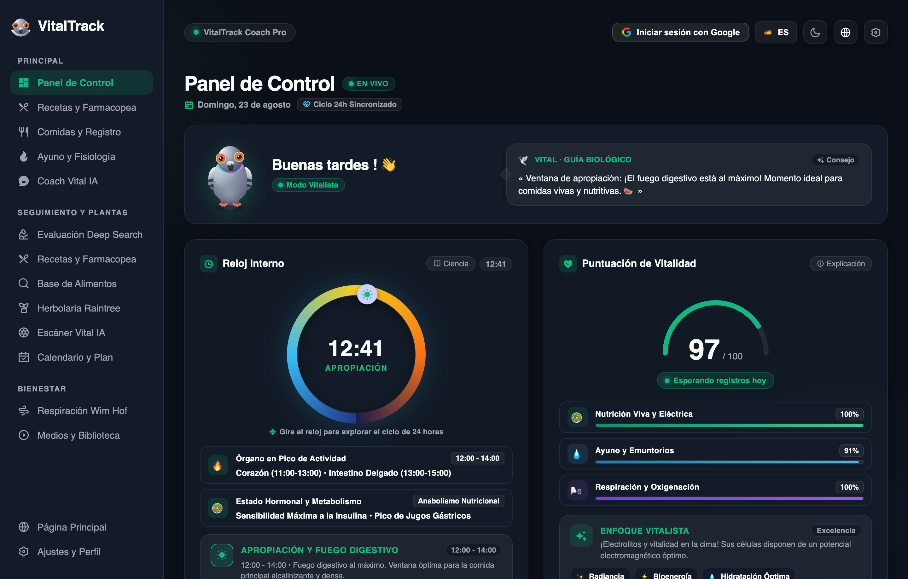<br/>
        <sub>Puntuación de Vitalidad 100/100, Reloj Circadiano de 24h y Foco de Asimilación Nocturna</sub>
      </td>
      <td width="50%" align="center">
        <strong>☀️ Modo Claro (Alto Contraste y Claridad Diurna)</strong><br/><br/>
        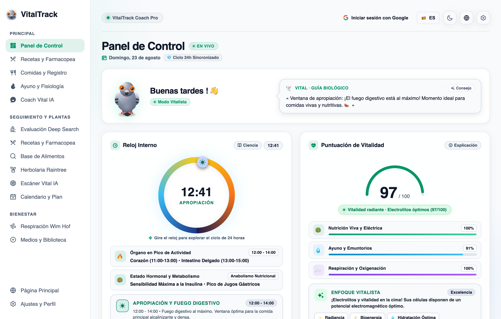<br/>
        <sub>Contraste certificado WCAG AAA, tipografía cuidada y dinamismo visual</sub>
      </td>
    </tr>
  </table>
</div>

<br/>

### 📱 Experiencia Móvil (iOS y Android — Galería Funcional)

<div align="center">
  <table>
    <tr>
      <td align="center" width="25%">
        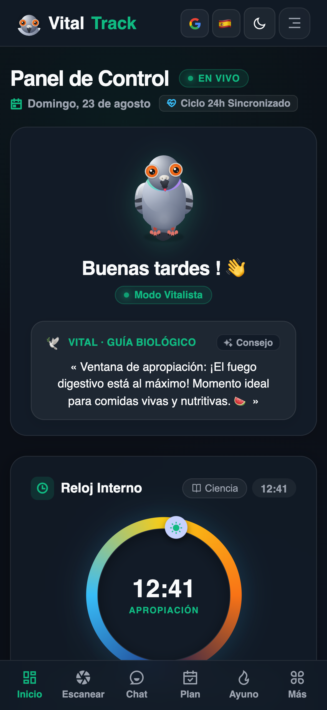<br/>
        <strong>📊 1. Panel Vital</strong><br/>
        <sub>Reloj Circadiano & Vitalidad</sub>
      </td>
      <td align="center" width="25%">
        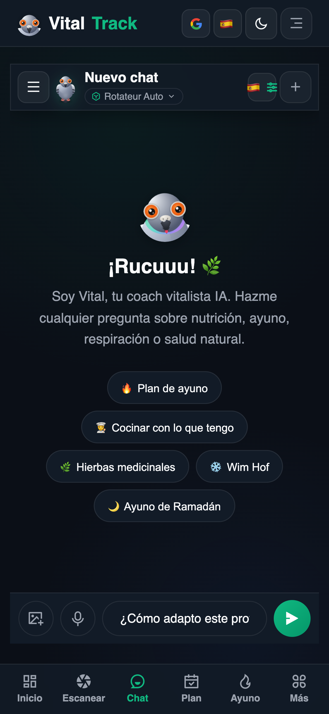<br/>
        <strong>🎙️ 2. Voz en Vivo</strong><br/>
        <sub>Streaming sin cuota & HUD</sub>
      </td>
      <td align="center" width="25%">
        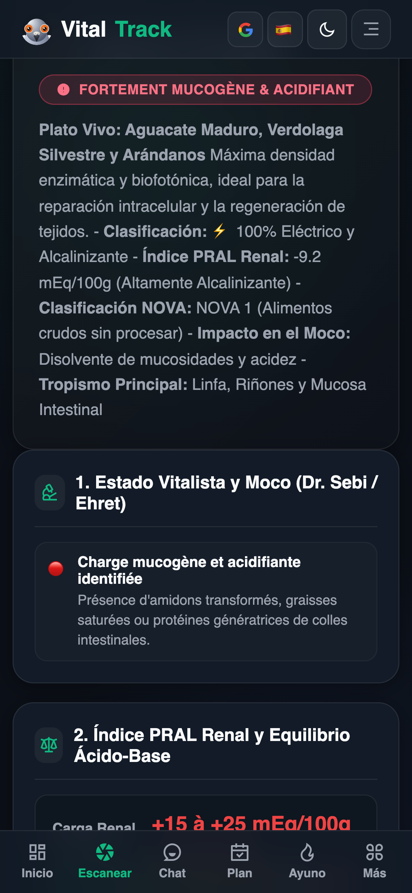<br/>
        <strong>📸 3. Escáner IA</strong><br/>
        <sub>PRAL Renal & Moco Intestinal</sub>
      </td>
      <td align="center" width="25%">
        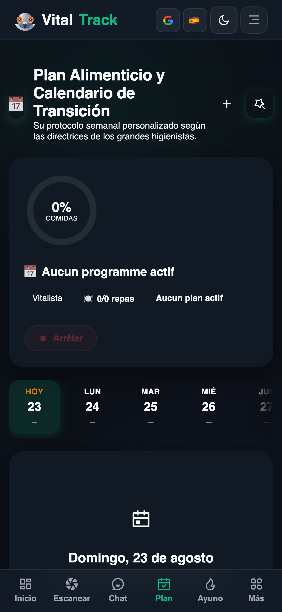<br/>
        <strong>📅 4. Calendario</strong><br/>
        <sub>Tira de 14 días & Validación</sub>
      </td>
    </tr>
    <tr>
      <td align="center" width="25%">
        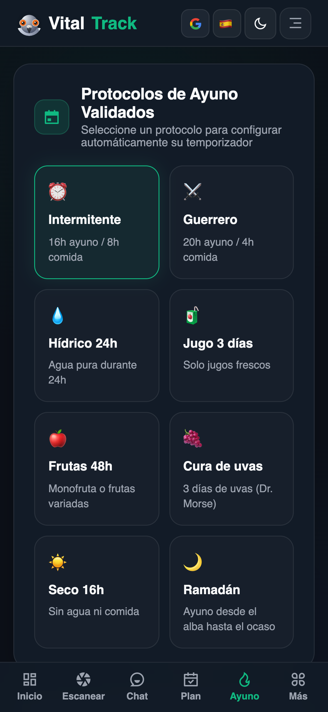<br/>
        <strong>⏳ 5. Ayuno & Autofagia</strong><br/>
        <sub>Etapas metabólicas & Cetosis</sub>
      </td>
      <td align="center" width="25%">
        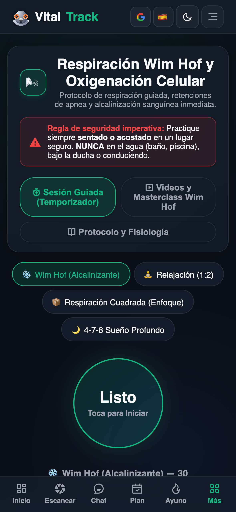<br/>
        <strong>🫁 6. Respiración Pránica</strong><br/>
        <sub>Wim Hof & Coherencia Cardíaca</sub>
      </td>
      <td align="center" width="25%">
        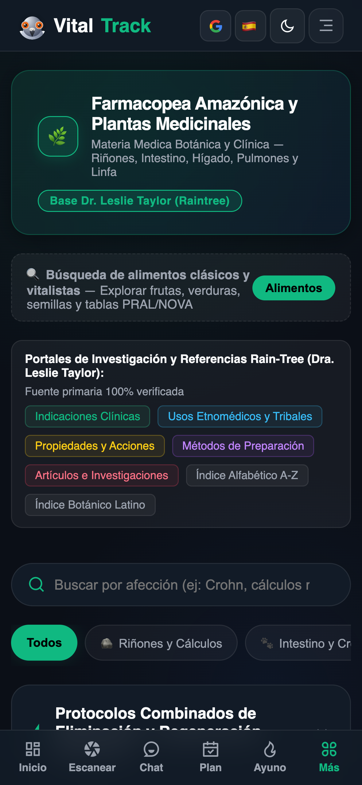<br/>
        <strong>🌿 7. Farmacopea</strong><br/>
        <sub>127+ Monografías Botánicas</sub>
      </td>
      <td align="center" width="25%">
        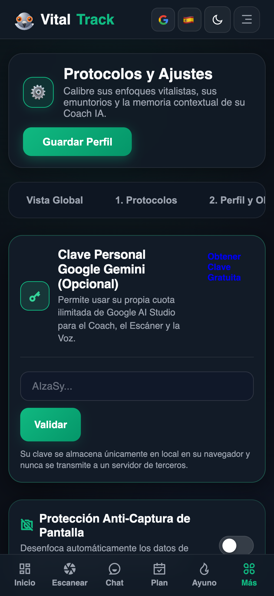<br/>
        <strong>🔒 8. Bóveda RGPD</strong><br/>
        <sub>Derecho al Olvido & Exportación</sub>
      </td>
    </tr>
  </table>
</div>

---

## 🌟 Los 6 Pilares Fundacionales de VitalTrack

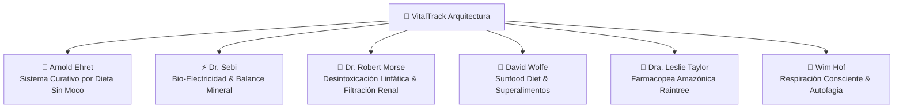

1. **🍇 Arnold Ehret (Sistema Curativo por Dieta Sin Moco)**:
   * Evaluación del potencial mucógeno de los alimentos y protocolos de transición gradual.
   * Ecuación fisiológica universal: (V = P - O) (Vitalidad = Potencia − Obstrucción).

2. **⚡ Dr. Sebi (Nutrición Bio-Eléctrica Celular)**:
   * Recomendaciones de alimentos vivos no hibridados con semillas fértiles (*Sea Moss, Fucus, Fonio, Bardana, Guanábana*).
   * Mantenimiento de la alcalinidad intracelular y eliminación de depósitos ácidos calcificados.

3. **🌊 Dr. Robert Morse (Milagro de la Desintoxicación Celular)**:
   * Drenaje del gran sistema linfático (80% de los fluidos corporales) y filtración renal activa.
   * Monodietas de frutas astringentes (*uvas negras, cítricos silvestres, sandías con semillas*) y fórmulas botánicas.

4. **🥑 David Wolfe (Sunfood Living Diet & Superalimentos)**:
   * Nutrición viva rica en biofotones, aceites vegetales prensados en frío y remineralización profunda.

5. **🌳 Dra. Leslie Taylor (Farmacopea Amazónica Raintree)**:
   * Base de más de 127 monografías botánicas certificadas (*Chanca Piedra, Pau d'Arco, Uña de Gato, Chuchuhuasi, Abuta, Samambaia*).
   * Indicaciones clínicas, compuestos fitoquímicos activos, métodos de preparación, posologías y contraindicaciones.

6. **🧘 Wim Hof (Maestría de la Respiración y Regeneración)**:
   * Sesiones interactivas guiadas con cronómetro de retención, alcalinización sanguínea y estimulación de la autofagia.

---

## ✨ Módulos Principales en Detalle

### 🔬 1. Evaluación Clínica Profunda (Deep Search 100% Gratuito)
* **Asistente de Anamnesis en 4 Pasos**: Perfil, síntomas emuntoriales, medicamentos actuales y biomarcadores sanguíneos.
* **Diagnóstico Holístico de los 5 Emuntorios**: Análisis cruzado de riñones, linfa, colon, hígado, pulmones y piel con informe imprimible y exportación JSON.

### 🤖 2. Coach IA Conversacional con Tarjetas de Acción Interactivas
* **Diálogo en streaming** impulsado por los modelos oficiales **Google Gemini 3.7 Flash** / **Gemini 3.6 Flash**.
* **Dictado por voz en vivo (Zero-Cuota)**: Reconocimiento de voz en tiempo real nativo del navegador con HUD animado de ondas sonoras.
* **14 Voces Neuronales Studio HD**: Locución de alta calidad en Español, Francés e Inglés.
* **Tarjetas de acción interactivas**: Generación de accesos directos en el chat (`📅 Aplicar al calendario`, `🍲 Guardar comida`, `🥗 Crear plato`).

<div align="center">
  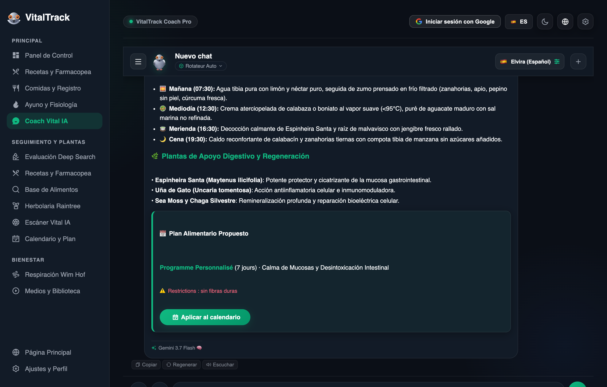
</div>

<br/>

### 📸 3. Escáner Visual de Platos y Diagnóstico Bioquímico IA
* Análisis instantáneo de fotografías de comida: identificación de ingredientes, clasificación **NOVA**, índice **PRAL renal** (+/− mEq/100g), índice formador de moco y sugerencias de alternativas vivas alcalinizantes.

<div align="center">
  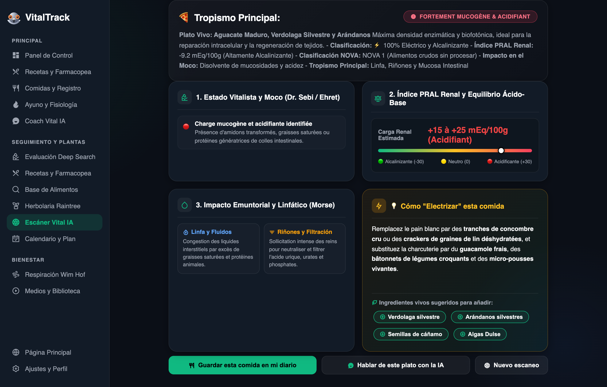
</div>

<br/>

### 🍽️ 4. Farmacopea Culinaria y Recetas Experimentadas
* Recetas auténticas seleccionadas según los maestros vitalistas (*Sebi, Ehret, Morse, Christopher, Kallas*).
* Calculador dinámico de porciones (1 a 12 comensales), búsqueda multi-ingrediente y guardado en favoritos con 1 clic.

### 📖 5. Biblioteca y Lector de Obras Completas Digitales
* Libros completos digitalizados (*Sistema Curativo por Dieta Sin Moco* de Arnold Ehret en español y francés; *El Milagro de la Desintoxicación* del Dr. Robert Morse).
* Glosario interactivo, navegación por capítulos, resaltado semántico y salto de página instantáneo.

### 🕊️ 6. Mascota Vital 3D HD Interactiva (Paloma Mensajera)
* Motor cinemático Canvas 2D con 7 animaciones orgánicas fluidas (*respirar, caminar, reír, arrullar, observar, celebrar, dormir*), efectos de sonido aviares y burbujas de diálogo dinámicas.

### ⚖️ 7. Registro de Peso, Fotos Privadas y Comparador Antes/Después
* Registro de pesajes, cálculo del IMC y seguimiento del peso objetivo.
* **Fotos 100% Locales en el Dispositivo** (IndexedDB aislada sin subida a la nube).
* Herramienta integrada de recorte no destructivo, rotación y comparador visual Antes/Después de doble modo (deslizador interactivo frente a lado a lado).

### ⏳ 8. Temporizador de Ayuno y Etapas Metabólicas
* 8 protocolos de ayuno (*16:8, 20:4 Warrior, 24h, 48h, 72h, Hídrico, Jugos, Frutas, Seco, Ramadán*).
* Visualización en tiempo real de las fases biológicas (*Digestión ➔ Caída de Insulina ➔ Cetosis ➔ Quema de Grasas ➔ Autofagia ➔ Regeneración*).
* Evaluación al finalizar el ayuno con diario de sensaciones y espejo mágico (*lengua saburral, ligereza, sudoración, sed, claridad*).

### 🫁 9. Estudio de Respiración Wim Hof y Coherencia Cardíaca
* Sesiones guiadas inmersivas: **Wim Hof 3 Rondas**, **Respiración Cuadrada (4-4-4-4)**, **Coherencia Cardíaca (5.5s)** y **4-7-8 Sueño**.
* Aviso de respiración de recuperación (15s), historial de récords de retención y fichas científicas del estudio de la Universidad de Radboud (2014).

### 🔒 10. Privacidad Absoluta y Cumplimiento Estricto del RGPD
* **Arquitectura Zero-Knowledge**: Sus datos de salud permanecen exclusivamente en su dispositivo.
* **Portabilidad de datos (Art. 20 RGPD)**: Exportación JSON completa en 1 clic.
* **Derecho al olvido total (Art. 17 RGPD)**: Eliminación permanente e instantánea de la cuenta, el historial y las fotos.
* **Protección Anti-Captura de Pantalla**: Desenfoque automático de métricas personales al compartir o grabar pantalla.

---

## 🏗️ Arquitectura Técnica y Estrategia FinOps Dual-Tier

```
┌──────────────────────────────────────────────────────────┐
│                   VitalTrack Frontend                    │
│      Vite + Vanilla Modern JS (ES6+) + CSS Responsivo    │
│   1.093 Claves i18n × 4 Idiomas (ES, EN, FR, FR-CA)=4.372│
└────────────────────────────┬─────────────────────────────┘
                             │
                             ▼
┌──────────────────────────────────────────────────────────┐
│              Capa API Serverless Vercel Edge             │
│        /api/chat  •  /api/deep-search  •  /api/scan      │
└────────────────────────────┬─────────────────────────────┘
                             │
              ┌──────────────┴──────────────┐
              ▼                             ▼
┌───────────────────────────┐ ┌───────────────────────────┐
│ Proyecto 1: Gratuito      │ │ Proyecto 2: Pago (Tier 1) │
│ projects/437214576475     │ │ projects/890941317890     │
│ (Absorbe 500 RPD a 0,00 €)│ │ (Failover automático 429) │
└───────────────────────────┘ └───────────────────────────┘
```

* **Frontend**: HTML5 semántico, variables CSS modernas con glassmorphism, módulos JavaScript ES6+ nativos, empaquetador Vite.
* **Modelos IA Oficiales**: `gemini-3.7-flash`, `gemini-3.6-flash`, `gemini-3.5-flash-lite`.
* **Voz y Multimedia**: Web Speech API STT nativa, Edge Neural TTS, transcodificación de audio multimodal.
* **Alojamiento**: [Vercel](https://vitaltrackapp.vercel.app) con alta disponibilidad global.

---

## 💻 Instalación y Desarrollo Local

```bash
# 1. Clonar el repositorio
git clone https://github.com/fnnktkygl-code/vital_track.git
cd vital_track

# 2. Instalar dependencias del frontend
cd web-app
npm install

# 3. Iniciar servidor de desarrollo local
npm run dev

# 4. Ejecutar la suite de pruebas automatizadas (10 suites completas)
cd ..
node tests/run_all_tests.mjs
```

---

## 🌐 Documentación Multilingüe

* [🇬🇧 **English (README.md)**](README.md)
* [🇫🇷 **Français (LISEZMOI.md)**](LISEZMOI.md)
* [🇪🇸 **Español (LEAME.md)**](LEAME.md)

---

## 📜 Cumplimiento y Licencia

* **Licencia:** Distribuido bajo la **Licencia MIT**. Consulte el archivo `LICENSE` para más detalles.
* **Protección de Datos:** Totalmente conforme con el Reglamento General de Protección de Datos (RGPD) de la Unión Europea. Consulte nuestra [Política de Privacidad](https://fnnktkygl-code.github.io/vital_track/privacy.html).
