# 🌱 VitalTrack — Compagnon IA de Santé Vitaliste, Nutrition Vivante & Régénération Cellulaire

<div align="center">

[](README.fr.md)
[](README.md)
[](README.es.md)

<br/>

[](https://vitaltrackapp.vercel.app)
[](https://fnnktkygl-code.github.io/vital_track/privacy.html)
[](https://vitaltrackapp.vercel.app)
[](https://vitaltrackapp.vercel.app)
[-purple?style=flat-square)](https://vitaltrackapp.vercel.app)
[](LICENSE)

<p align="center">
  <strong>VitalTrack</strong> est la plateforme tout-en-un dédiée à la <strong>santé holistique, la nutrition vitaliste et l'autophagie cellulaire</strong>.<br/>
  Elle réunit les enseignements cliniques des plus grands pionniers de la santé naturelle (<em>Arnold Ehret, Dr. Sebi, Dr. Robert Morse, David Wolfe, Dr. Leslie Taylor, Wim Hof</em>) avec une intelligence artificielle multimodale de pointe, une dictée vocale en streaming sans quota, une pharmacopée amazonienne complète et un cockpit de suivi physiologique hermétique.
</p>

[**🚀 Lancer l'Application Web**](https://vitaltrackapp.vercel.app) • [**📖 Guide Utilisateur Complet**](GUIDE.md) • [**🔒 Politique de Confidentialité**](https://fnnktkygl-code.github.io/vital_track/privacy.html) • [**🇬🇧 English README**](README.md) • [**🇪🇸 Versión en Español**](README.es.md)

</div>

---

## 📱 Aperçu & Galerie Vitrine

### 💻 Expérience Desktop (Grand Écran — Thème Sombre & Clair)

<div align="center">
  <table>
    <tr>
      <td width="50%" align="center">
        <strong>🌌 Thème Sombre (Immersion & Sérénité)</strong><br/><br/>
        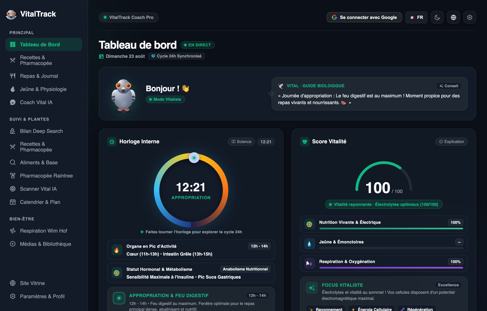<br/>
        <sub>Score Vitalité 100/100, Horloge Circadienne 24h & Focus d'assimilation nocturne</sub>
      </td>
      <td width="50%" align="center">
        <strong>☀️ Thème Clair (Haute Lisibilité)</strong><br/><br/>
        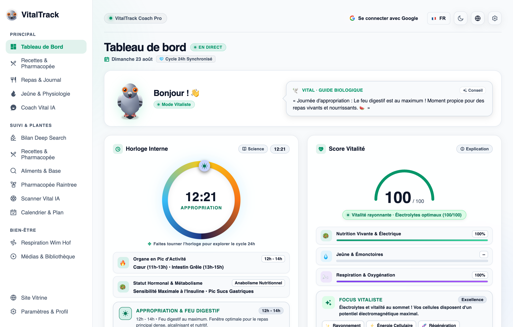<br/>
        <sub>Contraste certifié WCAG AAA, typographie soignée et dynamique visuelle</sub>
      </td>
    </tr>
  </table>
</div>

<br/>

### 📱 Expérience Mobile (iPhone & Android — Galerie Fonctionnelle)

<div align="center">
  <table>
    <tr>
      <td align="center" width="25%">
        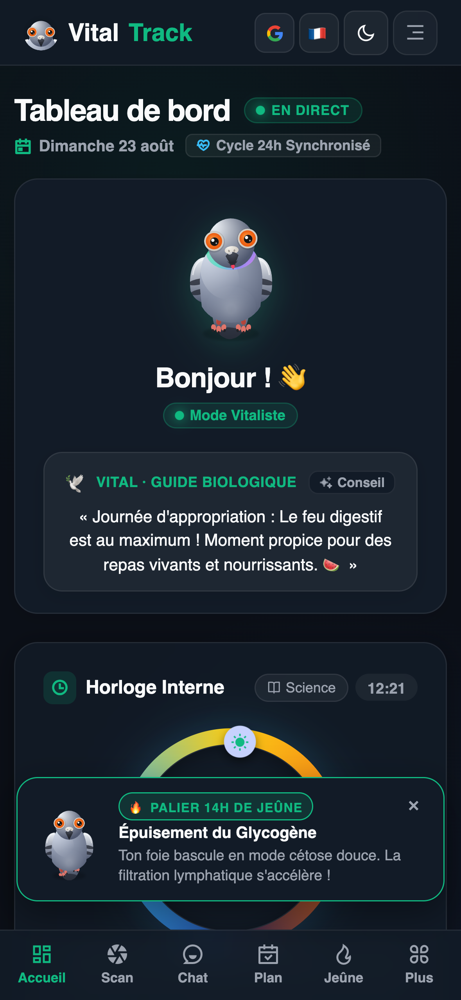<br/>
        <strong>📊 1. Cockpit Vital</strong><br/>
        <sub>Score & Horloge Circadienne</sub>
      </td>
      <td align="center" width="25%">
        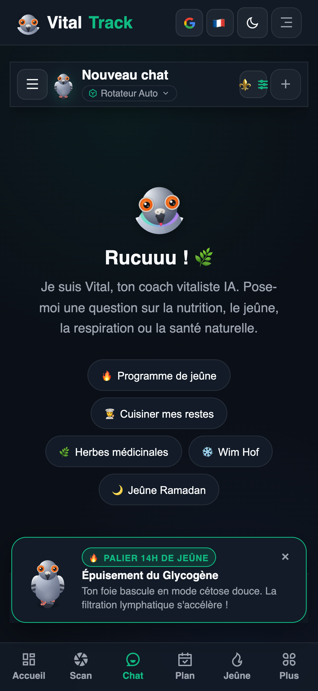<br/>
        <strong>🎙️ 2. Voix en Direct</strong><br/>
        <sub>Streaming sans quota & HUD</sub>
      </td>
      <td align="center" width="25%">
        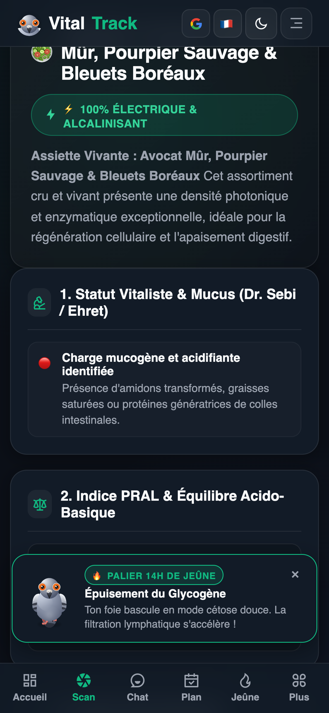<br/>
        <strong>📸 3. Scanner IA</strong><br/>
        <sub>PRAL Rénal & Électrisation</sub>
      </td>
      <td align="center" width="25%">
        <br/>
        <strong>📅 4. Calendrier Cockpit</strong><br/>
        <sub>Bandeau 14j & Validation tactile</sub>
      </td>
    </tr>
    <tr>
      <td align="center" width="25%">
        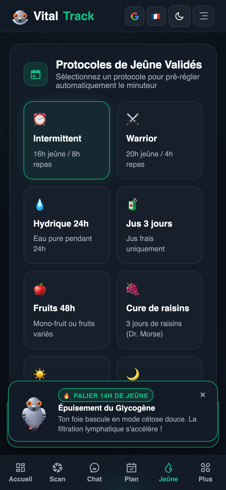<br/>
        <strong>⏳ 5. Jeûne & Autophagie</strong><br/>
        <sub>Paliers métaboliques & Cétose</sub>
      </td>
      <td align="center" width="25%">
        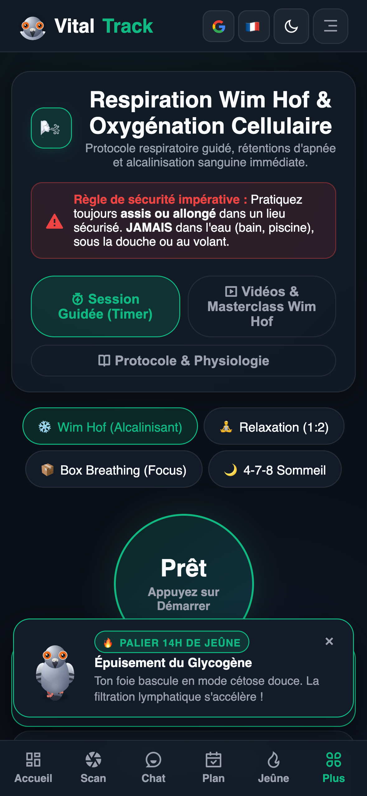<br/>
        <strong>🫁 6. Respiration Prānique</strong><br/>
        <sub>Wim Hof & Cohérence Cardiaque</sub>
      </td>
      <td align="center" width="25%">
        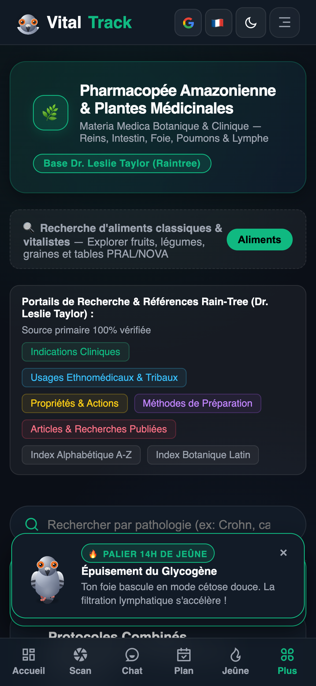<br/>
        <strong>🌿 7. Pharmacopée</strong><br/>
        <sub>Monographies botaniques</sub>
      </td>
      <td align="center" width="25%">
        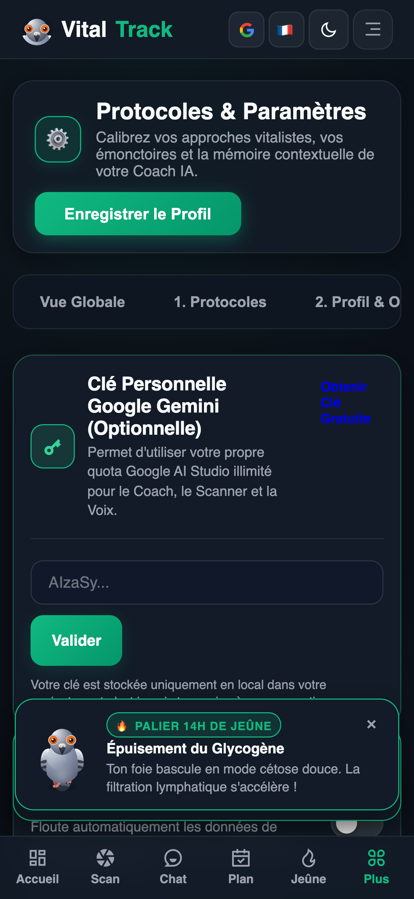<br/>
        <strong>🔒 8. Espace RGPD</strong><br/>
        <sub>Droit à l'oubli & Export 1-clic</sub>
      </td>
    </tr>
  </table>
</div>

---

## 🌟 Les 6 Piliers Fondateurs de VitalTrack

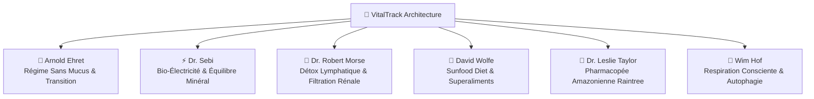

1. **🍇 Arnold Ehret (Système de Guérison du Régime Sans Mucus)** :
   * Évaluation quantitative de la formation de mucus et protocoles de transition progressive.
   * Équation universelle : (V = P - O) (Vitalité = Puissance Motrice − Obstruction interne).

2. **⚡ Dr. Sebi (Nutrition Bio-Électrique Cellulaire)** :
   * Recommandations d'aliments vivants non hybridés à graines fertiles (*Sea Moss, Fucus, Fonio, Bardane, Corossol*).
   * Maintien du pH alcalin intra-cellulaire et élimination des dépôts acides.

3. **🌊 Dr. Robert Morse (Miracle de la Détoxication Cellulaire)** :
   * Drainage du grand système lymphatique (80% des liquides du corps) et filtration rénale active.
   * Mono-diètes de fruits astringents (*raisins noirs, agrumes sauvages, melons à pépins*) et formules botaniques.

4. **🥑 David Wolfe (Sunfood Diet & Superaliments)** :
   * Alimentation vivante à haute énergie photonique, huiles végétales crues et minéralisation profonde.

5. **🌳 Dr. Leslie Taylor (Pharmacopée Amazonienne Raintree)** :
   * Base de 127+ monographies botaniques certifiées (*Chanca Piedra, Pau d'Arco, Griffe de Chat, Chuchuhuasi, Abuta, Samambaia*).
   * Indications cliniques, principes actifs phytochimiques, méthodes de préparation, posologies et contre-indications.

6. **🧘 Wim Hof (Maîtrise du Souffle & Régénération)** :
   * Sessions interactives guidées avec chronomètre de rétention, alcalinisation gazeuse et stimulation de l'autophagie.

---

## ✨ Fonctionnalités Majeures en Détail

### 🔬 1. Bilan Clinique Approfondi (Deep Search 100% Gratuit)
* **Assistant d'Anamnèse en 4 Étapes** : Bio-Profil, symptômes émonctoriels, traitements en cours et biomarqueurs sanguins.
* **Synthèse Holistique des 5 Émonctoires** : Analyse croisée des reins, de la lymphe, du côlon, du foie, des poumons et de la peau avec rapport imprimable et export JSON.

### 🤖 2. Coach IA Conversationnel & Cartes d'Actions Interactives
* **Dialogue en streaming** propulsé par **Google Gemini 3.7 Flash** / **Gemini 3.6 Flash**.
* **Dictée vocale en direct (Zero-Quota)** : Reconnaissance vocale temps réel native sans consommer de quota payant avec retour visuel d'ondes sonores en continu.
* **14 Voix Neuronales Studio HD** : Narration naturelle en Français (France & Québec), Anglais et Espagnol.
* **Cartes d'actions interactives directes** : Génération de raccourcis dans le chat (`📅 Appliquer au calendrier`, `🍲 Enregistrer le repas`, `🥗 Créer un plat`).

<div align="center">
  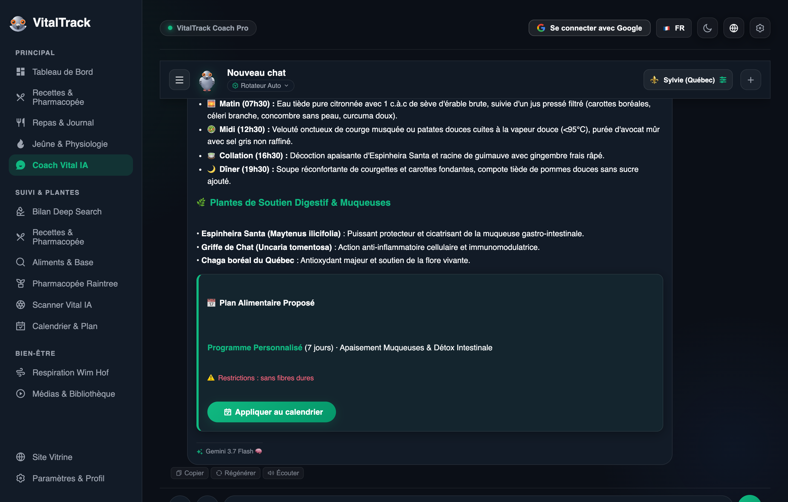
</div>

<br/>

### 📸 3. Scanner Visuel d'Assiette & Diagnostic Biochimique IA
* Analyse instantanée d'une photo de plat : identification des ingrédients, calcul du score **NOVA**, indice **PRAL rénal** (+/− mEq/100g), charge colloïdale de mucus et propositions d'alternatives vivantes électrisantes.

<div align="center">
  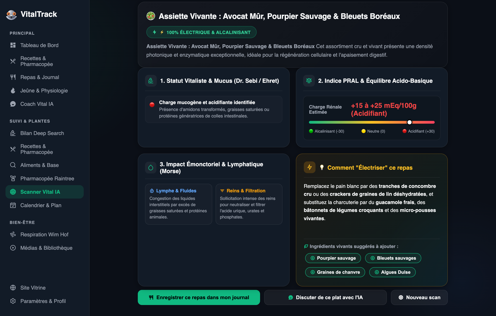
</div>

<br/>

### 🍽️ 4. Pharmacopée Culinaire & Recettes Éprouvées
* Recettes authentiques élaborées selon les maîtres vitalistes (*Sebi, Ehret, Morse, Christopher, Kallas*).
* Calculateur dynamique de portions (1 à 12 personnes), recherche multi-ingrédients et sauvegarde dans les favoris.

### 📖 5. Bibliothèque & Lecteur d'Ouvrages Intégraux
* Livres intégraux numérisés (*Système de Guérison du Régime Sans Mucus* d'Arnold Ehret en FR/ES, *Le Guide du Miracle de la Détox* du Dr. Robert Morse).
* Glossaire interactif, navigation par chapitres, surlignage sémantique et saut de page instantané.

### 🕊️ 6. Mascotte Vitale 3D HD Interactive (Pigeon Biset Voyageur)
* Moteur cinématique Canvas 2D avec 7 animations organiques fluides (*respirer, marcher, rire, roucouler, observer, célébrer, dormir*), effets sonores aviaires et bulles de dialogues réactives.

### ⚖️ 7. Suivi Morphologique, Photos Privées & Comparateur Avant/Après
* Enregistrement des pesées, calcul de l'IMC et suivi de l'objectif de poids.
* **Photos 100% Locales sur l'Appareil** (IndexedDB isolée sans transfert cloud).
* Outil intégré de rognage non-destructif, rotation et comparateur visuel Avant/Après à double mode (glissière interactive vs côte-à-côte).

### ⏳ 8. Minuteur de Jeûne & Paliers Métaboliques
* 8 protocoles de jeûne (*16:8, 20:4 Warrior, 24h, 48h, 72h, Hydrique, Jus, Fruits, Sec, Ramadan*).
* Visualisation en temps réel des paliers physiologiques (*Digestion ➔ Chute Insuline ➔ Cétose ➔ Brûlage Graisses ➔ Autophagie ➔ Régénération*).
* Bilan de clôture de jeûne avec journal de ressenti et miroir magique (*langue chargée, légèreté, transpiration, soif, clarté*).

### 🫁 9. Studio de Respiration Wim Hof & Cohérence Cardiaque
* Sessions guidées immersives : **Wim Hof 3 Rounds**, **Respiration Carrée (4-4-4-4)**, **Cohérence Cardiaque (5.5s)** et **4-7-8 Sommeil**.
* Alerte de récupération 15s, historique des records de rétention et fiches scientifiques de l'étude Radboud 2014.

### 🔒 10. Confidentialité Absolue & Conformité RGPD Hermétique
* **Architecture Zero-Knowledge** : vos données médicales et personnelles restent strictement sur votre machine.
* **Portabilité des données (Art. 20 RGPD)** : export JSON complet en 1 clic.
* **Droit à l'oubli intégral (Art. 17 RGPD)** : effacement complet et immédiat du compte, de l'historique et des photos.
* **Protection Anti-Capture d'Écran** : floutage automatique des données lors des partages d'écran.

---

## 🏗️ Architecture Technique & Stratégie FinOps Dual-Tier

```
┌──────────────────────────────────────────────────────────┐
│                   VitalTrack Frontend                    │
│      Vite + Vanilla Modern JS (ES6+) + CSS Responsive    │
│   1 065 clés i18n × 4 langues (FR, EN, ES, FR-CA) = 4 260│
└────────────────────────────┬─────────────────────────────┘
                             │
                             ▼
┌──────────────────────────────────────────────────────────┐
│             Couche API Serverless Vercel Edge            │
│        /api/chat  •  /api/deep-search  •  /api/scan      │
└────────────────────────────┬─────────────────────────────┘
                             │
              ┌──────────────┴──────────────┐
              ▼                             ▼
┌───────────────────────────┐ ┌───────────────────────────┐
│ Projet 1 : Gratuit (Free) │ │ Projet 2 : Payant (Tier 1)│
│ projects/437214576475     │ │ projects/890941317890     │
│ (Absorbe 500 RPD à 0,00 €)│ │ (Bascule auto si 429/503) │
└───────────────────────────┘ └───────────────────────────┘
```

* **Frontend** : HTML5 sémantique, CSS variables modernes avec glassmorphism, modules JavaScript ES6+ natifs, bundler Vite.
* **Modèles IA Officiels** : `gemini-3.7-flash`, `gemini-3.6-flash`, `gemini-3.5-flash-lite`.
* **Voix & Médias** : Web Speech API STT native, Edge Neural TTS, transcodage audio multimodal.
* **Hébergement** : [Vercel](https://vitaltrackapp.vercel.app) en haute disponibilité globale.

---

## 💻 Installation & Développement Local

```bash
# 1. Cloner le dépôt
git clone https://github.com/fnnktkygl-code/vital_track.git
cd vital_track

# 2. Installer les dépendances frontend
cd web-app
npm install

# 3. Lancer le serveur de développement local
npm run dev

# 4. Lancer la suite de tests automatisés (10 suites complètes)
cd ..
node tests/run_all_tests.mjs
```

---

## 🌐 Documentation Multilingue

* [🇬🇧 **English (README.md)**](README.md)
* [🇫🇷 **Français (README.fr.md)**](README.fr.md)
* [🇪🇸 **Español (README.es.md)**](README.es.md)

---

## 📜 Conformité & Licence

* **Licence :** Distribué sous licence **MIT**. Consultez le fichier `LICENSE`.
* **Protection des Données :** Conforme au Règlement Général sur la Protection des Données (RGPD). Consultez notre [Politique de Confidentialité](https://fnnktkygl-code.github.io/vital_track/privacy.html).
