# 🌱 VitalTrack — AI-Powered Vitalist Health, Nutrition & Cellular Regeneration Companion

<div align="center">

[](README.md)
[](LISEZMOI.md)
[](LEAME.md)

<br/>

[](https://vitaltrackapp.vercel.app)
[](https://fnnktkygl-code.github.io/vital_track/privacy.html)
[](https://vitaltrackapp.vercel.app)
[](https://vitaltrackapp.vercel.app)
[-purple?style=flat-square)](https://vitaltrackapp.vercel.app)
[](LICENSE)

<p align="center">
  <strong>VitalTrack</strong> is the all-in-one health, vitalist nutrition, and cellular regeneration platform.<br/>
  Unifying clinical principles from pioneering natural healers (<em>Arnold Ehret, Dr. Sebi, Dr. Robert Morse, David Wolfe, Dr. Leslie Taylor, Wim Hof</em>) with multimodal Artificial Intelligence, zero-quota live voice dictation, Amazonian pharmacopeia, and a private biometric cockpit.
</p>

[**🚀 Launch Web App**](https://vitaltrackapp.vercel.app) • [**📖 User Guide**](GUIDE.md) • [**🔒 Privacy Policy**](https://fnnktkygl-code.github.io/vital_track/privacy.html) • [**🇫🇷 Version Française (LISEZMOI.md)**](LISEZMOI.md) • [**🇪🇸 Versión en Español (LEAME.md)**](LEAME.md)

</div>

---

## 🎬 Interactive Video Walkthrough & Feature Demo

<div align="center">
  <video src="https://raw.githubusercontent.com/fnnktkygl-code/vital_track/main/docs/videos/vitaltrack_demo.mp4" controls="controls" width="100%" style="max-width:920px; border-radius:14px; box-shadow:0 8px 24px rgba(0,0,0,0.4);">
    <source src="docs/videos/vitaltrack_demo.mp4" type="video/mp4">
    Your browser does not support the video tag.
  </video>
  <p><sub><i>▶️ Interactive Journey: Vitalist Cockpit ➔ AI Coach Consultation ➔ Action Card Calendar Sync ➔ Biochemical Plate Scanner ➔ Fasting & Autophagy Tracker ➔ Wim Hof Breathwork</i></sub></p>
</div>

---

## 📱 Visual Showcase & App Gallery

### 💻 Desktop Experience (Dark & Light Themes)

<div align="center">
  <table>
    <tr>
      <td width="50%" align="center">
        <strong>🌌 Dark Mode (Serene & Immersive)</strong><br/><br/>
        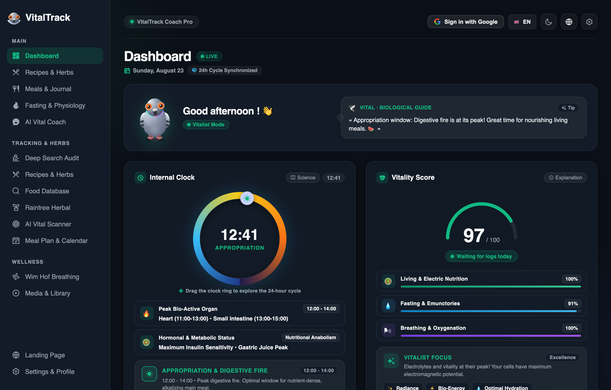<br/>
        <sub>Vitality Score 100/100, 24h Circadian Clock & Nighttime Cellular Regeneration Focus</sub>
      </td>
      <td width="50%" align="center">
        <strong>☀️ Light Mode (High Contrast & Daylight Clarity)</strong><br/><br/>
        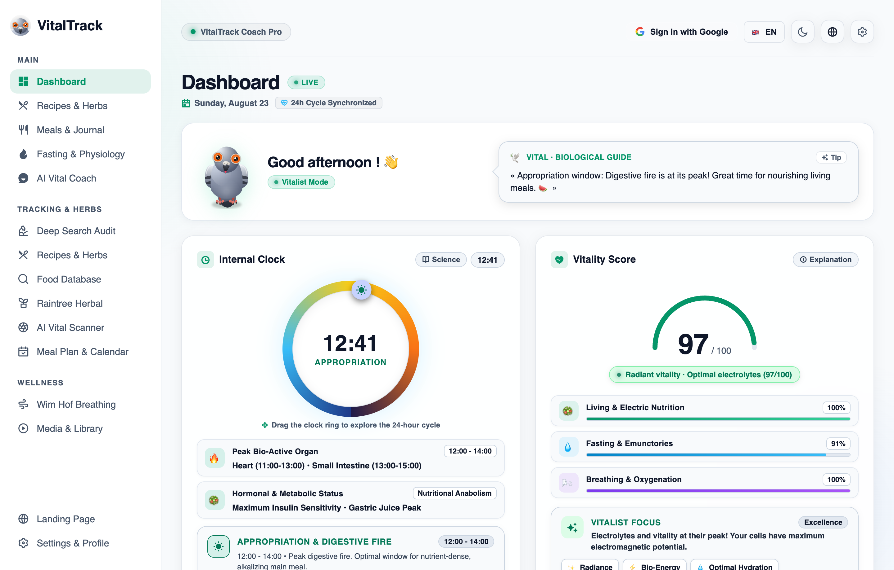<br/>
        <sub>WCAG AAA Certified Contrast, Clean Typography & Instant Visual Dynamics</sub>
      </td>
    </tr>
  </table>
</div>

<br/>

### 📱 Mobile Experience (iOS & Android Showcase)

<div align="center">
  <table>
    <tr>
      <td align="center" width="25%">
        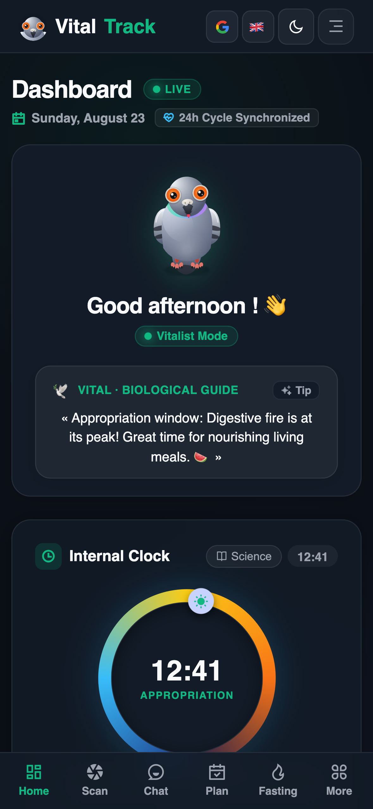<br/>
        <strong>📊 1. Vital Cockpit</strong><br/>
        <sub>Circadian Clock & Vitality Index</sub>
      </td>
      <td align="center" width="25%">
        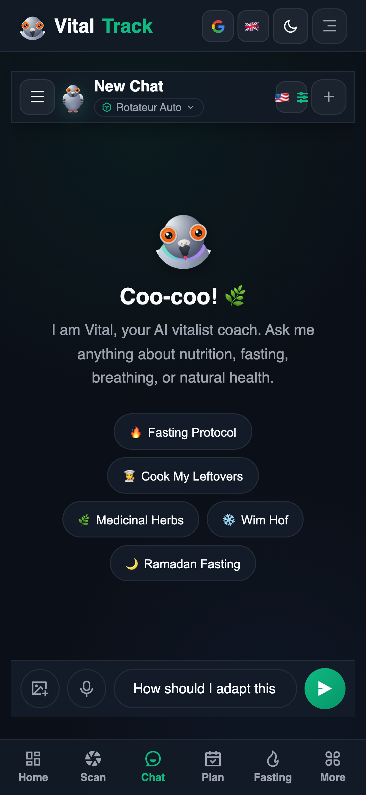<br/>
        <strong>🎙️ 2. Live Voice Coach</strong><br/>
        <sub>Zero-Quota Speech & Waveform HUD</sub>
      </td>
      <td align="center" width="25%">
        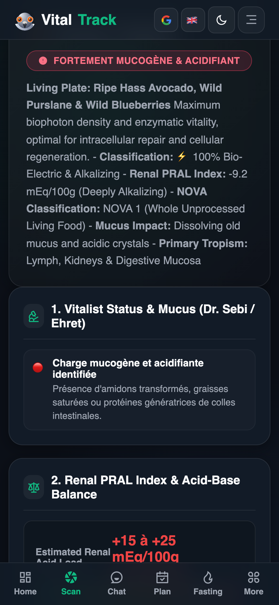<br/>
        <strong>📸 3. AI Plate Scanner</strong><br/>
        <sub>Renal PRAL, NOVA & Mucus Impact</sub>
      </td>
      <td align="center" width="25%">
        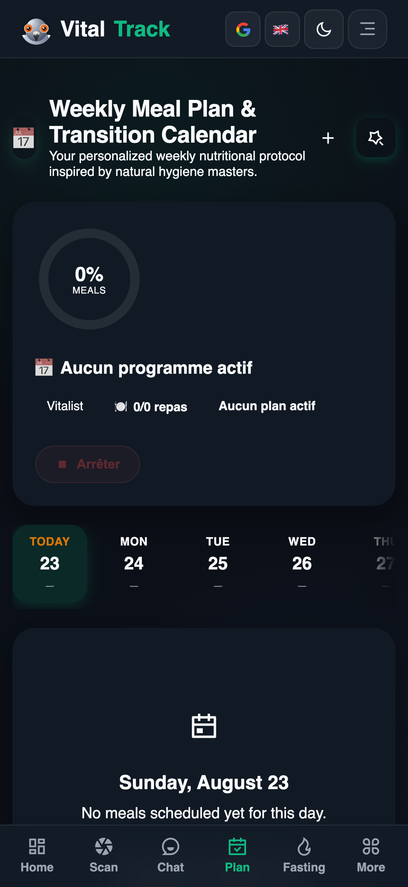<br/>
        <strong>📅 4. Diet Calendar</strong><br/>
        <sub>14-Day Strip & One-Touch Log</sub>
      </td>
    </tr>
    <tr>
      <td align="center" width="25%">
        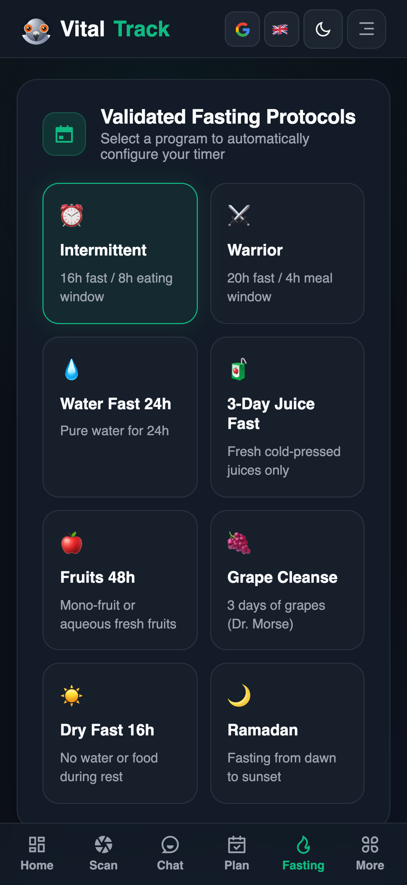<br/>
        <strong>⏳ 5. Fasting Tracker</strong><br/>
        <sub>Metabolic Stages & Autophagy</sub>
      </td>
      <td align="center" width="25%">
        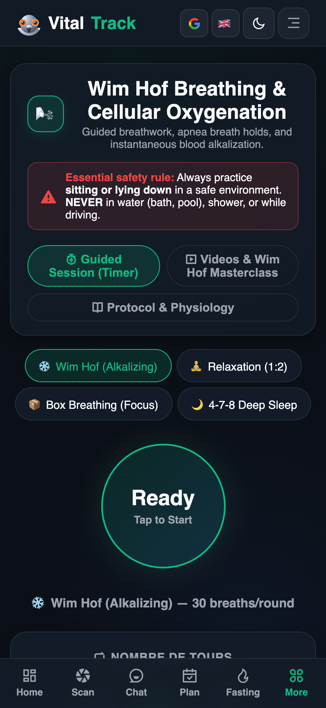<br/>
        <strong>🫁 6. Breathing Studio</strong><br/>
        <sub>Wim Hof 3 Rounds & Heart Coherence</sub>
      </td>
      <td align="center" width="25%">
        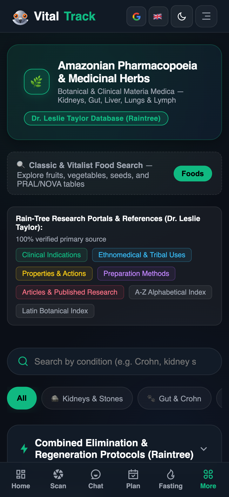<br/>
        <strong>🌿 7. Pharmacopeia</strong><br/>
        <sub>127+ Amazonian Monographs</sub>
      </td>
      <td align="center" width="25%">
        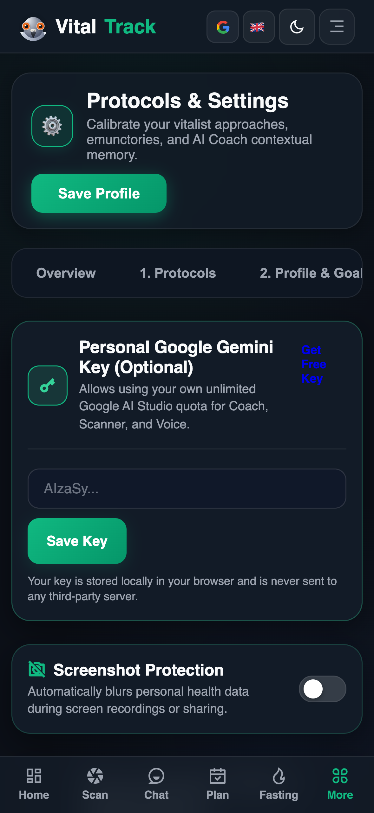<br/>
        <strong>🔒 8. GDPR Vault</strong><br/>
        <sub>Right to be Forgotten & 1-Click Export</sub>
      </td>
    </tr>
  </table>
</div>

---

## 🌟 Foundational Natural Health Pillars

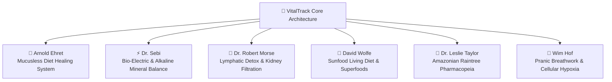

1. **🍇 Arnold Ehret (Mucusless Diet Healing System)**:
   * Quantitative mucus-forming food evaluation and step-by-step transition protocols.
   * Universal physiological equation: (V = P - O) (Vitality = Power − Obstruction).

2. **⚡ Dr. Sebi (Cellular Bio-Mineral Balance)**:
   * Electric, living, non-hybridized native food list (*Sea Moss, Bladderwrack, Fonio, Burdock, Soursop*).
   * Intracellular alkalinity maintenance and elimination of calcified acid waste.

3. **🌊 Dr. Robert Morse (Cellular Detox Miracle)**:
   * Systemic lymphatic drainage (80% of interstitial body fluid) and open kidney filtration tracking.
   * Astringent mono-fruit fasts (*black grapes, wild citrus, seeded melons*) and botanical formulas.

4. **🥑 David Wolfe (Sunfood Living Diet & Superfoods)**:
   * Biophoton-rich living nutrition, cold-pressed plant fats, and deep remineralization.

5. **🌳 Dr. Leslie Taylor (Raintree Amazonian Pharmacopeia)**:
   * 127+ verified botanical monographs (*Chanca Piedra, Pau d'Arco, Cat's Claw, Chuchuhuasi, Abuta, Samambaia*).
   * Clinical indications, active phytochemicals, preparation methods, posology, and contraindications.

6. **🧘 Wim Hof (Breath Mastery & Neuro-Vascular Control)**:
   * Interactive guided breathwork with retention tracking, blood alkalization, and autophagy stimulation.

---

## ✨ Key Feature Modules

### 🔬 1. Clinical Deep Search (100% Free Vitalist Health Assessment)
* **4-Step Comprehensive Intake Wizard**: Profile, organ symptoms, current treatments, and blood biomarkers.
* **Holistic 5-Emunctory Diagnostics**: Synthesizes kidney filtration, lymphatic stagnation, colon transit, liver burden, and respiratory elimination into an actionable health road-map with PDF & JSON export.

### 🤖 2. Conversational AI Coach with Interactive Action Cards
* **Multimodal Streaming** powered by official **Google Gemini 3.7 Flash** / **Gemini 3.6 Flash**.
* **Zero-Quota Live Voice Dictation**: Real-time browser speech-to-text with continuous animated waveform HUD.
* **14 Neural Studio HD Voice Options**: High-fidelity narration across French, English, and Spanish.
* **Direct Action Cards**: Generates interactive cards in chat (`📅 Apply to Calendar`, `🍲 Save Meal`, `🥗 Custom Dishes`).

<div align="center">
  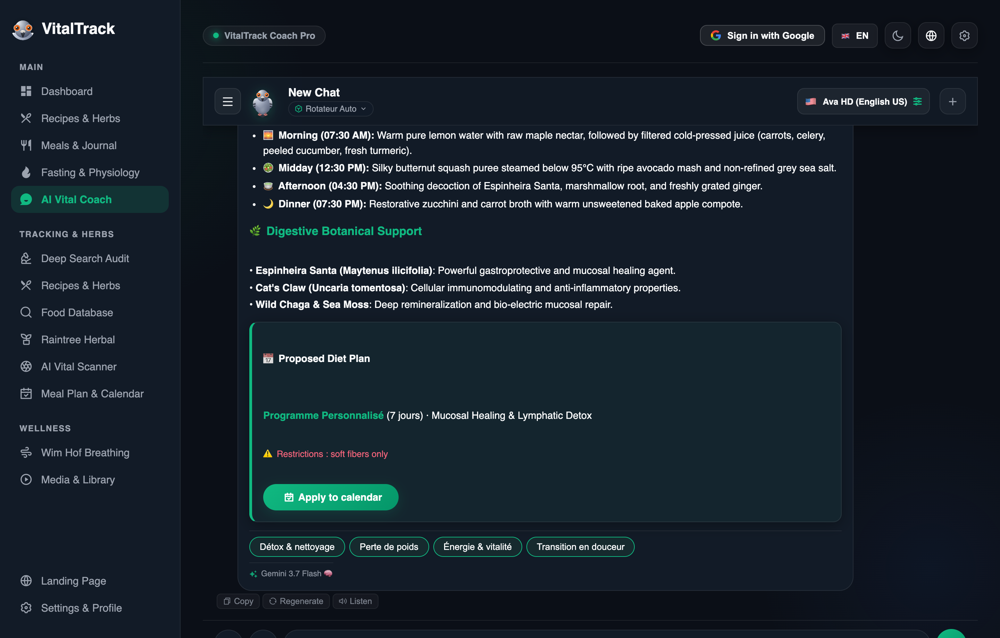
</div>

<br/>

### 📸 3. Visual AI Plate Scanner & Biochemical Diagnostic
* Instant image diagnosis: ingredient identification, **NOVA score**, renal **PRAL index** (+/− mEq/100g), mucus formation rating, and living electric food alternatives.

<div align="center">
  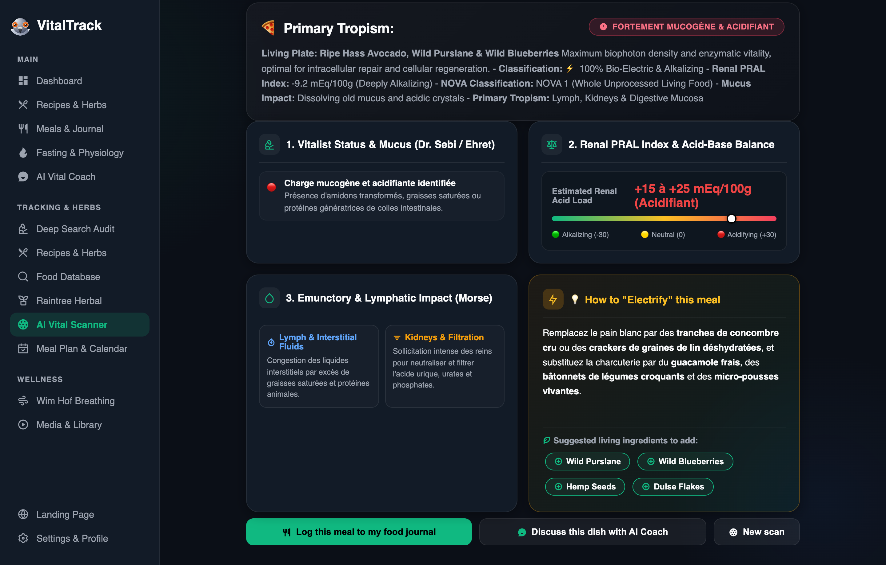
</div>

<br/>

### 🍽️ 4. Culinary Pharmacopeia & Dynamic Portion Kitchen
* Authentic recipes curated from master vitalist practitioners (*Sebi, Ehret, Morse, Christopher, Kallas*).
* Dynamic serving calculation from 1 to 12 portions, ingredient multi-tag search, and 1-click favorite saving.

### 📖 5. Complete Digital Masterworks & Semantic Reader
* Full digitized unabridged books (*The Mucusless Diet Healing System* by Arnold Ehret in English, French & Spanish; *The Detox Miracle Sourcebook* by Dr. Robert Morse).
* Interactive glossary annotations, instant chapter navigation, search term highlighter, and page jumping.

### 🕊️ 6. 3D HD Interactive Vital Mascot (Homing Pigeon)
* Smooth Canvas 2D cinematic character with 7 organic state animations (*idle, walk, laugh, coo, think, celebrate, sleep*), sound effects, interactive speech bubbles, and mood pills.

### ⚖️ 7. Weight Log, Local Photo Privacy & Dual-Mode Before/After Comparator
* Log weights, calculate BMI and target distance.
* **100% On-Device Photo Storage** via IndexedDB with zero cloud transmission.
* Built-in non-destructive image cropper, rotation engine, and dual-mode Before/After visual comparator (interactive slider vs side-by-side).

### ⏳ 8. Fasting Timer & Metabolic Stages Tracker
* 8 fasting protocols (*16:8, 20:4 Warrior, 24h, 48h, 72h, Water, Juice, Fruit, Dry, Ramadan*).
* Real-time biological phase progress (*Digestion ➔ Insulin Drop ➔ Ketosis ➔ Fat Burning ➔ Autophagy ➔ Regeneration*).
* End-of-fast debrief with Magic Mirror elimination signs logger (*coated tongue, lightness, sweat, thirst, euphoria*).

### 🫁 9. Wim Hof & Pranic Breathing Studio
* Guided sessions: **Wim Hof 3 Rounds**, **Box Breathing (4-4-4-4)**, **Cardiac Coherence (5.5s)**, and **4-7-8 Sleep**.
* Recovery breath triggers (15s), retention record history, and Radboud University (2014) medical study cards.

### 🔒 10. Zero-Knowledge Privacy & GDPR Compliance
* **Zero-Knowledge Architecture**: All personal health records stay on your local device.
* **Data Portability (GDPR Art. 20)**: Complete JSON export in 1 click.
* **Right to be Forgotten (GDPR Art. 17)**: Instant, permanent account and IndexedDB photo purge.
* **Anti-Screenshot Privacy Mask**: Blur sensitive health metrics during screen sharing or recording.

---

## 🏗️ Technical Architecture & FinOps Dual-Tier Strategy

```
┌──────────────────────────────────────────────────────────┐
│                   VitalTrack Frontend                    │
│      Vite + Vanilla Modern JS (ES6+) + Responsive CSS     │
│   1,093 i18n Keys × 4 Locales (EN, FR, ES, FR-CA) = 4,372 │
└────────────────────────────┬─────────────────────────────┘
                             │
                             ▼
┌──────────────────────────────────────────────────────────┐
│             Vercel Serverless Edge API Layer             │
│        /api/chat  •  /api/deep-search  •  /api/scan      │
└────────────────────────────┬─────────────────────────────┘
                             │
              ┌──────────────┴──────────────┐
              ▼                             ▼
┌───────────────────────────┐ ┌───────────────────────────┐
│ Tier 1: Free Tier Project │ │ Tier 2: Paid Resilience   │
│ projects/437214576475     │ │ projects/890941317890     │
│ (Absorbs 500 RPD @ $0.00) │ │ (Automatic 429 Failover)  │
└───────────────────────────┘ └───────────────────────────┘
```

* **Frontend Engine**: Semantic HTML5, Glassmorphic CSS variables, Vanilla ES6+ modules, Vite bundler.
* **AI Model Routing**: Official Google Generative Language endpoints (`gemini-3.7-flash`, `gemini-3.6-flash`, `gemini-3.5-flash-lite`).
* **Speech & Media**: Native Web Speech API STT, Edge Neural TTS, FFmpeg audio transcoding.
* **Deployment**: Hosted globally on [Vercel](https://vitaltrackapp.vercel.app) with GitHub Pages documentation mirror.

---

## 💻 Local Development & Quick Start

```bash
# 1. Clone the repository
git clone https://github.com/fnnktkygl-code/vital_track.git
cd vital_track

# 2. Install web application dependencies
cd web-app
npm install

# 3. Run local development server
npm run dev

# 4. Run automated test suite (10/10 test suites)
cd ..
node tests/run_all_tests.mjs
```

---

## 🌐 Multilingual Documentation

* [🇬🇧 **English (README.md)**](README.md)
* [🇫🇷 **Français (LISEZMOI.md)**](LISEZMOI.md)
* [🇪🇸 **Español (LEAME.md)**](LEAME.md)

---

## 📜 Compliance & License

* **License:** Distributed under the **MIT License**. See `LICENSE` for details.
* **Privacy & GDPR:** Fully compliant with European GDPR / RGPD regulations. Consult our [Privacy Policy](https://fnnktkygl-code.github.io/vital_track/privacy.html).
