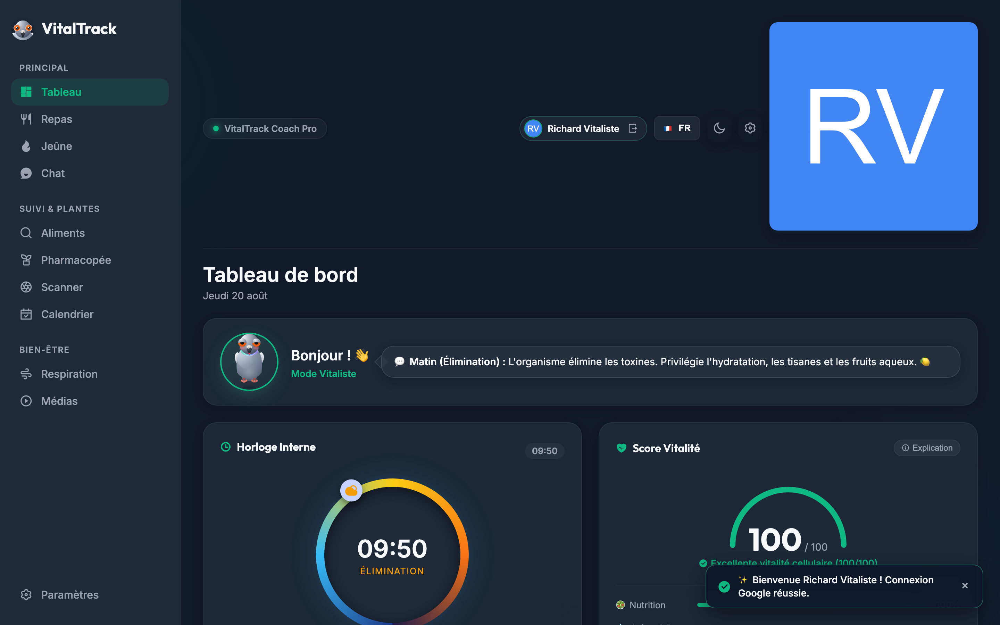
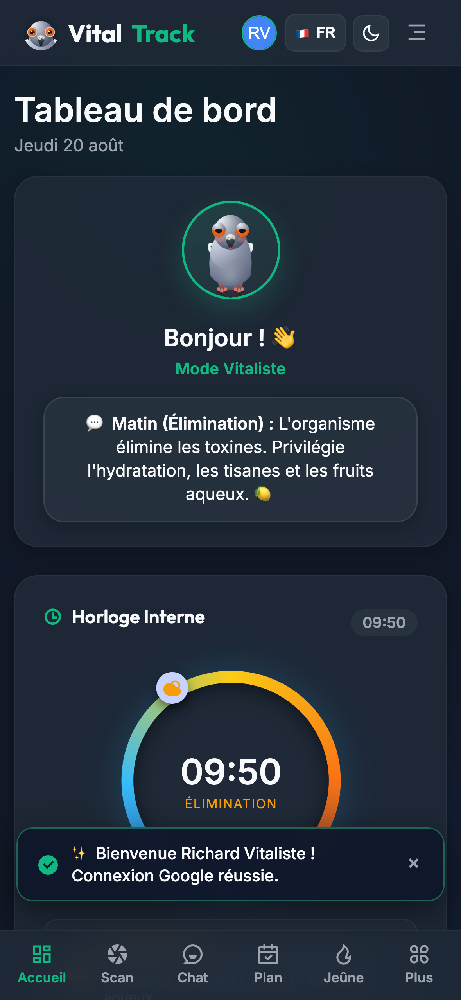
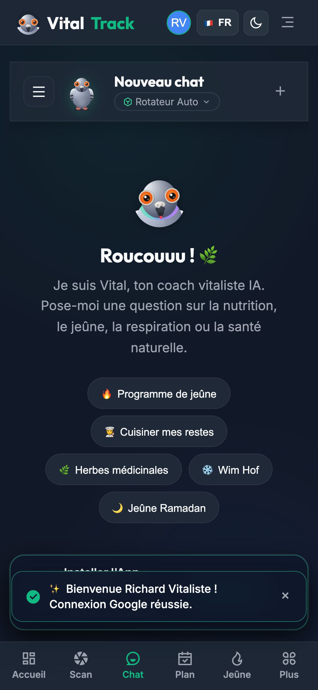
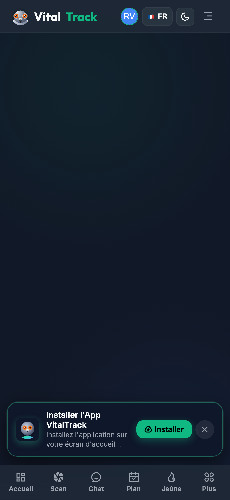
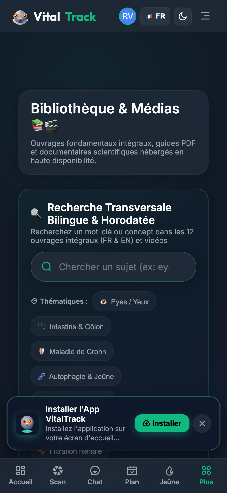
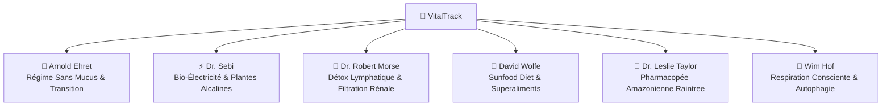
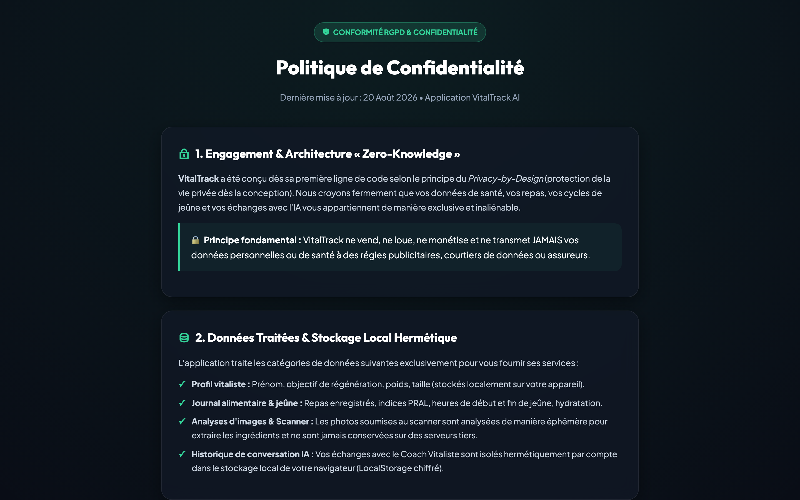

# 🌱 VitalTrack — AI-Powered Vitalist Health, Nutrition & Autophagy Companion

[](https://vitaltrackapp.vercel.app)
[](https://fnnktkygl-code.github.io/vital_track/privacy.html)
[](https://vitaltrackapp.vercel.app)
[](LICENSE)

> **VitalTrack** est l'application compagnon ultime dédiée à la **santé holistique, la nutrition vitaliste et la régénération cellulaire**. Elle réunit les enseignements des plus grands pionniers de la santé naturelle (*Arnold Ehret, Dr. Sebi, Dr. Robert Morse, David Wolfe, Dr. Leslie Taylor, Wim Hof*) avec une intelligence artificielle multimodale de pointe.

---

## 📱 Aperçu & Captures d'Écran (Showcase App Store)

### 💻 Expérience Desktop (Grand Écran)
<div align="center">
  
  <p><em>Tableau de bord vitaliste unifié : Chronomètre de jeûne, Score de Vitalité Biologique et Suivi des repas vivants.</em></p>
</div>

<br/>

### 📱 Expérience Mobile (iPhone 15 Pro & Android)

<div align="center">
  <table>
    <tr>
      <td align="center" width="25%">
        <br/>
        <strong>📊 1. Tableau de Bord</strong><br/>
        <sub>Autophagie & Vitalité</sub>
      </td>
      <td align="center" width="25%">
        <br/>
        <strong>💬 2. Coach IA</strong><br/>
        <sub>Conseils & RAG Vitaliste</sub>
      </td>
      <td align="center" width="25%">
        <br/>
        <strong>📸 3. Scanner IA</strong><br/>
        <sub>PRAL & Électrisation</sub>
      </td>
      <td align="center" width="25%">
        <br/>
        <strong>🎬 4. Vidéos & Masterclasses</strong><br/>
        <sub>Doublage Français Multi-Voix</sub>
      </td>
    </tr>
  </table>
</div>

---

## 🚀 Liens & Accès Directs

* 🌐 **Application Web en Production :** [vitaltrackapp.vercel.app](https://vitaltrackapp.vercel.app)
* 🛡️ **Politique de Confidentialité & RGPD :** [fnnktkygl-code.github.io/vital_track/privacy.html](https://fnnktkygl-code.github.io/vital_track/privacy.html)
* 📦 **Dépôt GitHub Officiel :** [github.com/fnnktkygl-code/vital_track](https://github.com/fnnktkygl-code/vital_track)

---

## 🌟 Les 6 Piliers Fondateurs de VitalTrack



1. **🍇 Arnold Ehret (Système de Guérison du Régime Sans Mucus)** :
   * Analyse du potentiel mucogène des aliments et protocoles de transition progressive.
   * Équation fondamentale : $V = P - E$ (Vitalité = Puissance - Élimination/Obstruction).

2. **⚡ Dr. Sebi (Nutrition Bio-Électrique Cellulaire)** :
   * Recommandations d'aliments natifs vivants, non hybridés à graines fertiles (Sea Moss, Fucus, Fonio, Burdock).
   * Maintien du pH alcalin intra-cellulaire et élimination des dépôts acides.

3. **🌊 Dr. Robert Morse (Miracle de la Détoxication Cellulaire)** :
   * Drainage du système lymphatique et ouverture des 4 grands émonctoires (reins, peau, intestins, poumons).
   * Mono-diètes de fruits astringents (raisins noirs, agrumes sauvages, pastèques à pépins).

4. **🥑 David Wolfe (Sunfood Diet & Superaliments)** :
   * Alimentation vivante à haute énergie photonique, huiles végétales crues et minéralisation profonde.

5. **🌳 Dr. Leslie Taylor (Pharmacopée Amazonienne Raintree)** :
   * Base de données complète de monographies botaniques (Pau d'Arco, Griffe de Chat, Chuchuhuasi, etc.).

6. **🧘 Wim Hof (Maîtrise du Souffle & Régénération)** :
   * Sessions de respiration guidées immersives avec rétentions d'oxygène et stimulation de l'autophagie.

---

## ✨ Fonctionnalités Majeures

### 🤖 1. Coach IA Vitaliste Multimodal
* Dialogue intelligent en streaming propulsé par **Google Gemini**.
* Réponses étayées par le corpus documentaire authentique des pionniers de la santé naturelle.
* Reconnaissance vocale et transcription en direct.

### 📸 2. Scanner Visuel & Diagnostic d'Assiette IA
* Prenez une photo de votre plat : l'IA identifie instantanément les ingrédients, calcule la classification **NOVA**, l'indice **PRAL** rénal (+/- mEq/100g) et suggère des substituts vivants pour électriser le repas.

### ⏳ 3. Traqueur de Jeûne & Autophagie
* Suivi de tous les rythmes de jeûne : **16:8, 18:6, 20:4 (Warrior), 24h, 36h (Moine), Jeûne sec ou hydrique, et Ramadan**.
* Chronomètre dynamique, paliers métaboliques en temps réel (cétose, autophagie, pic d'hormone de croissance).

### 🫁 4. Studio de Respiration Prānique
* Sessions interactives : **Méthode Wim Hof 3 rounds**, **Respiration Carrée (Box Breathing 4-4-4-4)**, **Cohérence Cardiaque (5.5s)** et **Respiration 4-7-8**.
* Compte à rebours visuel et guidage audio immersif.

### 📚 5. Médiathèque Bilingue HD & Masterclasses
* Vidéos de référence disponibles en **Version Originale Anglaise** et en **Version Française avec Doublage Studio Multi-Voix Continu** (alternance des voix de Rock Newman et du Dr. Sebi avec synchronisation Whisper).

### 🔒 6. Confidentialité & RGPD Intégral
* **Architecture Zero-Knowledge** : vos données sont isolées localement sur votre appareil.
* **Droit à la portabilité (Art. 20)** : export JSON complet en 1 clic.
* **Droit à l'oubli (Art. 17)** : effacement complet et définitif en 1 clic.
* **Bouton de déconnexion immédiate** et gestion hermétique par profil Google.

<div align="center">
  
</div>

---

## 🛠️ Stack Technique

* **Frontend :** HTML5 Sémantique, Vanilla CSS Modern (Glassmorphism, CSS Variables, Responsive Grid), JavaScript ES6+ Modules.
* **Build Tool & Bundler :** [Vite](https://vitejs.dev/)
* **IA & Vision :** Google Gemini API / Edge Neural TTS / Whisper (Apple Silicon Metal GPU).
* **Audio / Vidéo Engine :** FFmpeg, Canvas 2D Dynamic Mascot Renderer.
* **Hébergement :** [Vercel](https://vercel.com/) (Serverless Architecture) + GitHub Pages.

---

## 💻 Installation & Développement Local

```bash
# 1. Cloner le dépôt
git clone https://github.com/fnnktkygl-code/vital_track.git
cd vital_track

# 2. Installer les dépendances du frontend
cd web-app
npm install

# 3. Lancer le serveur de développement local
npm run dev
```

---

## 📜 Conformité & Licence

* **Licence :** Distribué sous licence **MIT**.
* **Protection des Données :** Conforme au Règlement Européen sur la Protection des Données (RGPD). Consultez la [Politique de Confidentialité](https://fnnktkygl-code.github.io/vital_track/privacy.html).
