# 🌱 VitalTrack — AI-Powered Vitalist Health, Nutrition & Autophagy Companion

[](https://vitaltrackapp.vercel.app)
[](https://fnnktkygl-code.github.io/vital_track/privacy.html)
[](https://vitaltrackapp.vercel.app)
[](https://vitaltrackapp.vercel.app)
[](LICENSE)

> **VitalTrack** est l'application compagnon tout-en-un dédiée à la **santé holistique, la nutrition vitaliste et la régénération cellulaire**. Elle réunit les enseignements des plus grands pionniers de la santé naturelle (*Arnold Ehret, Dr. Sebi, Dr. Robert Morse, David Wolfe, Dr. Leslie Taylor, Wim Hof*) avec une intelligence artificielle multimodale de pointe, une saisie vocale en direct et un cockpit de suivi physiologique.

---

## 📱 Aperçu & Galerie Vitrine (Showcase Store)

### 💻 Expérience Desktop (Grand Écran — Thème Sombre & Clair)

<div align="center">
  <table>
    <tr>
      <td width="50%" align="center">
        <strong>🌌 Thème Sombre (Immersion & Sérénité)</strong><br/><br/>
        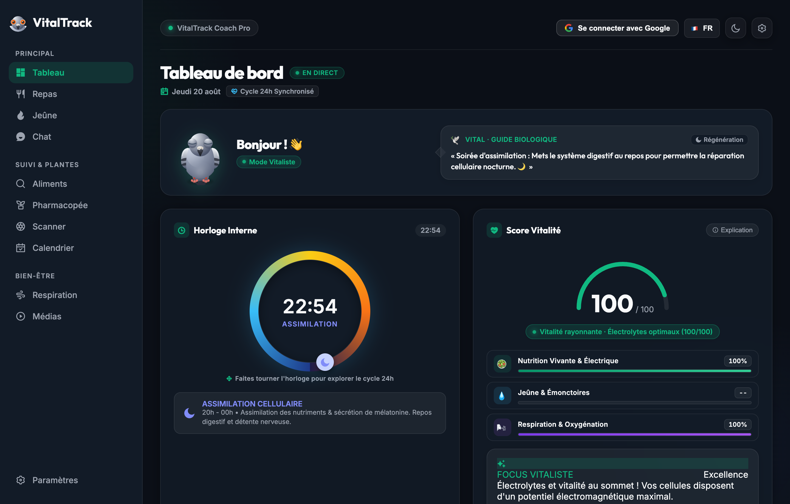<br/>
        <sub>Score Vitalité 100/100, Horloge Circadienne 24h & Focus d'assimilation nocturne</sub>
      </td>
      <td width="50%" align="center">
        <strong>☀️ Thème Clair (Haute Lisibilité)</strong><br/><br/>
        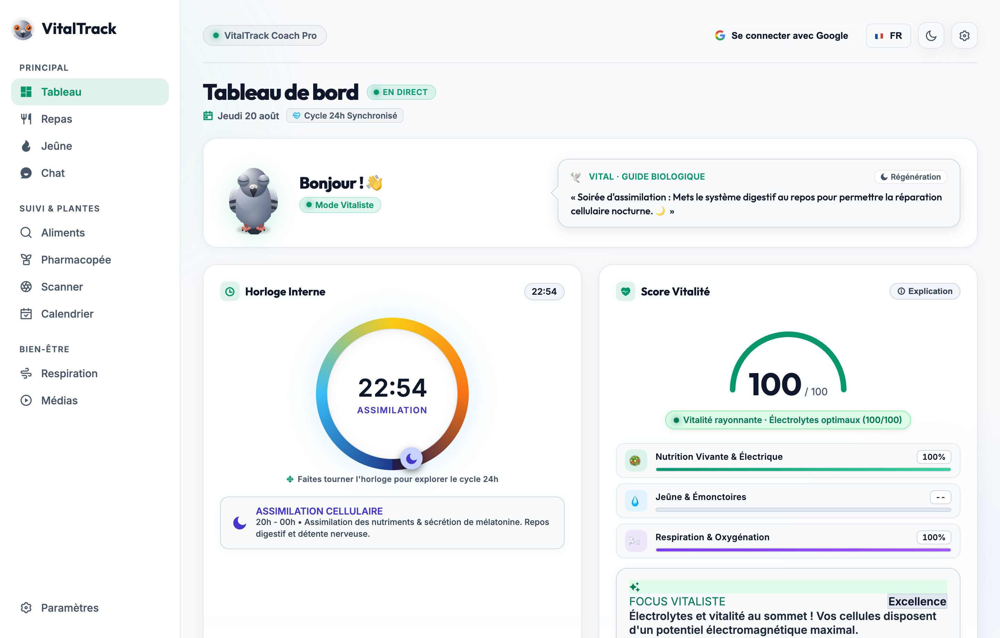<br/>
        <sub>Contraste certifié WCAG AAA, typographie soignée et dynamique visuelle</sub>
      </td>
    </tr>
  </table>
</div>

<br/>

### 📱 Expérience Mobile (iPhone 15 Pro & Android — Galerie Fonctionnelle)

<div align="center">
  <table>
    <tr>
      <td align="center" width="25%">
        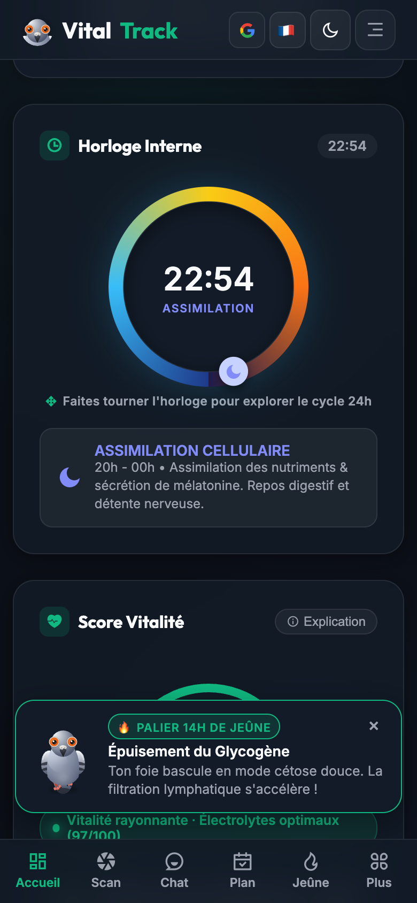<br/>
        <strong>📊 1. Cockpit Vital</strong><br/>
        <sub>Score & Horloge Circadienne</sub>
      </td>
      <td align="center" width="25%">
        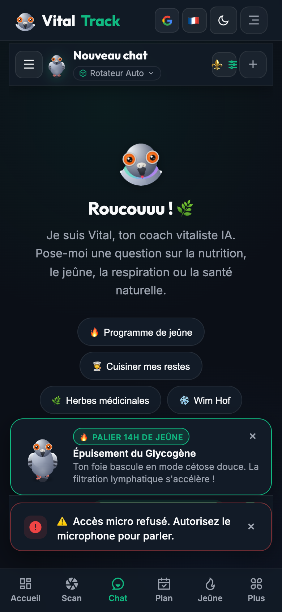<br/>
        <strong>🎙️ 2. Voix en Direct</strong><br/>
        <sub>Streaming sans quota & HUD</sub>
      </td>
      <td align="center" width="25%">
        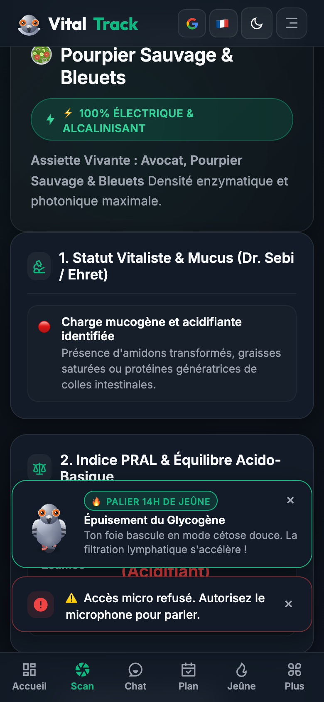<br/>
        <strong>📸 3. Scanner IA</strong><br/>
        <sub>PRAL Rénal & Électrisation</sub>
      </td>
      <td align="center" width="25%">
        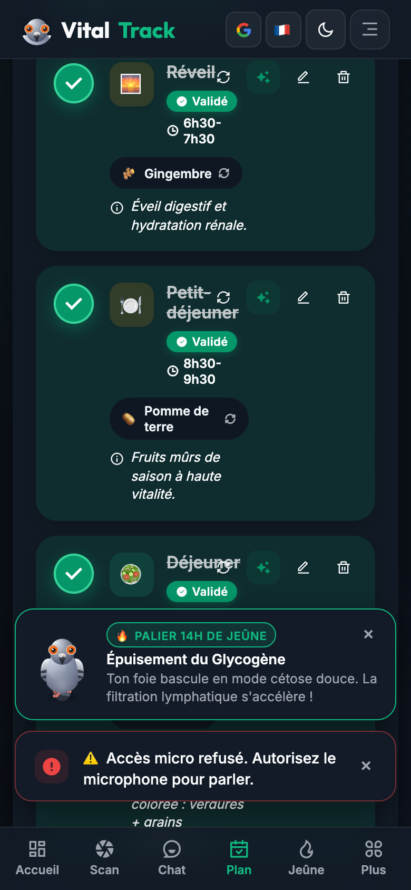<br/>
        <strong>📅 4. Calendrier Cockpit</strong><br/>
        <sub>Bandeau 14j & Validation tactile</sub>
      </td>
    </tr>
    <tr>
      <td align="center" width="25%">
        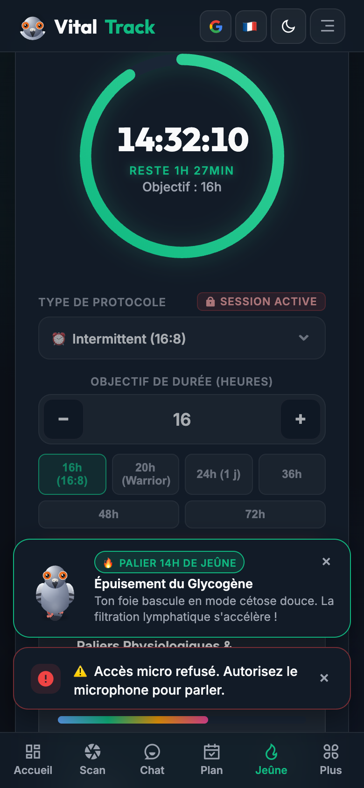<br/>
        <strong>⏳ 5. Jeûne & Autophagie</strong><br/>
        <sub>Paliers métaboliques & Cétose</sub>
      </td>
      <td align="center" width="25%">
        <br/>
        <strong>🫁 6. Respiration Prānique</strong><br/>
        <sub>Wim Hof & Cohérence Cardiaque</sub>
      </td>
      <td align="center" width="25%">
        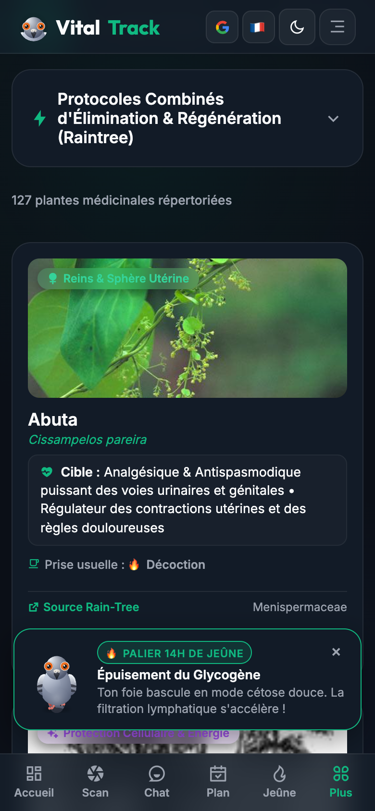<br/>
        <strong>🌿 7. Pharmacopée</strong><br/>
        <sub>Monographies botaniques</sub>
      </td>
      <td align="center" width="25%">
        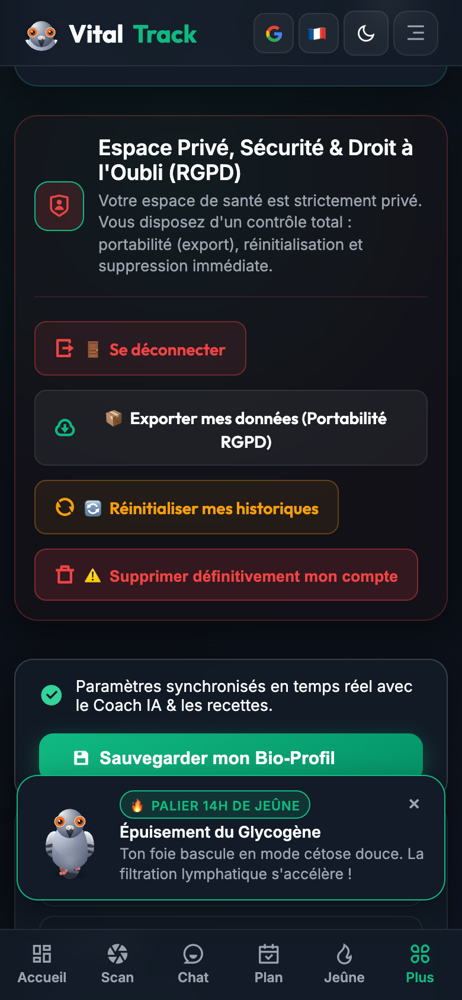<br/>
        <strong>🔒 8. Espace RGPD</strong><br/>
        <sub>Droit à l'oubli & Export 1-clic</sub>
      </td>
    </tr>
  </table>
</div>

---

## 🚀 Liens & Accès Directs

* 🌐 **Application Web en Production :** [vitaltrackapp.vercel.app](https://vitaltrackapp.vercel.app)
* 📖 **Guide Complet d'Utilisation :** [Consulter le GUIDE.md](GUIDE.md)
* 🛡️ **Politique de Confidentialité & RGPD :** [fnnktkygl-code.github.io/vital_track/privacy.html](https://fnnktkygl-code.github.io/vital_track/privacy.html)
* 📦 **Dépôt GitHub Officiel :** [github.com/fnnktkygl-code/vital_track](https://github.com/fnnktkygl-code/vital_track)

---

## 🌟 Les 6 Piliers Fondateurs de VitalTrack

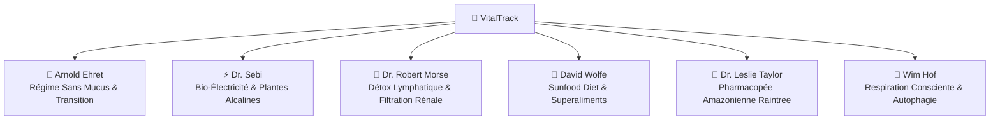

1. **🍇 Arnold Ehret (Système de Guérison du Régime Sans Mucus)** :
   * Analyse du potentiel mucogène des aliments et protocoles de transition progressive.
   * Équation fondamentale : $V = P - E$ (Vitalité = Puissance - Élimination/Obstruction).

2. **⚡ Dr. Sebi (Nutrition Bio-Électrique Cellulaire)** :
   * Recommandations d'aliments natifs vivants, non hybridés à graines fertiles (Sea Moss, Fucus, Fonio, Burdock).
   * Maintien du pH alcalin intra-cellulaire et élimination des dépôts acides.

3. **🌊 Dr. Robert Morse (Miracle de la Détoxication Cellulaire)** :
   * Drainage du grand système lymphatique (80% des liquides du corps) et filtration rénale.
   * Mono-diètes de fruits astringents (raisins noirs, agrumes sauvages, pastèques à pépins).

4. **🥑 David Wolfe (Sunfood Diet & Superaliments)** :
   * Alimentation vivante à haute énergie photonique, huiles végétales crues et minéralisation profonde.

5. **🌳 Dr. Leslie Taylor (Pharmacopée Amazonienne Raintree)** :
   * Base de données complète de monographies botaniques (Chanca Piedra, Pau d'Arco, Griffe de Chat, Chuchuhuasi).

6. **🧘 Wim Hof (Maîtrise du Souffle & Régénération)** :
   * Sessions de respiration guidées immersives avec rétentions d'oxygène et stimulation de l'autophagie.

---

## ✨ Fonctionnalités Majeures en Détail

### 🤖 1. Coach IA Conversationnel & Call to Action Automatiques
* **Dialogue immersif en streaming** propulsé par **Google Gemini 3.7 Flash**.
* **Dictée vocale en direct (Zero-Quota)** : Reconnaissance vocale temps réel avec l'API Web Speech native du navigateur (0 quota consommé, HUD animé avec ondes sonores et boutons instantanés).
* **Protocoles structurés de bout en bout** : Explications physiologiques détaillées, planning repas par repas (Matin, Midi, Collation, Soir) et génération automatique de cartes d'actions interactives (`📅 Appliquer au calendrier`, `🍲 Enregistrer le repas`, `🥗 Suggestions`).

<div align="center">
  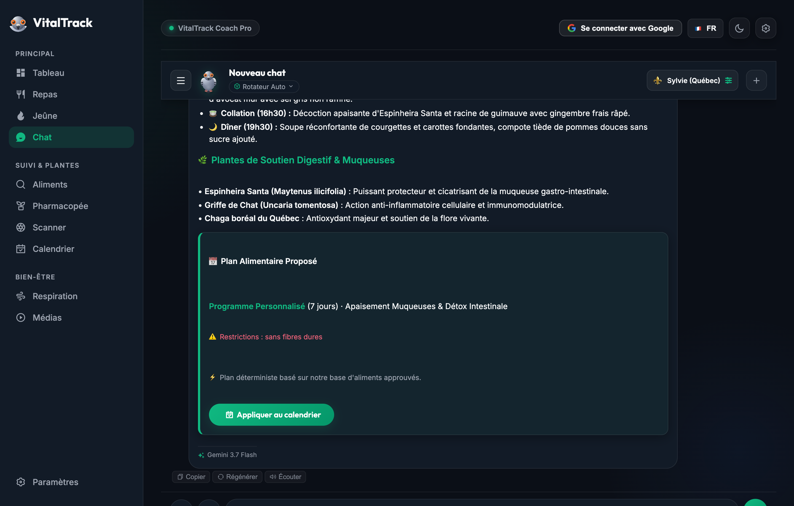
</div>

<br/>

### 📸 2. Scanner Visuel & Diagnostic d'Assiette IA
* Prenez une photo ou importez votre assiette : l'IA identifie instantanément les ingrédients, calcule la classification **NOVA**, l'indice **PRAL** rénal (+/- mEq/100g), l'impact lymphatique et suggère des substituts vivants pour électriser le repas.

<div align="center">
  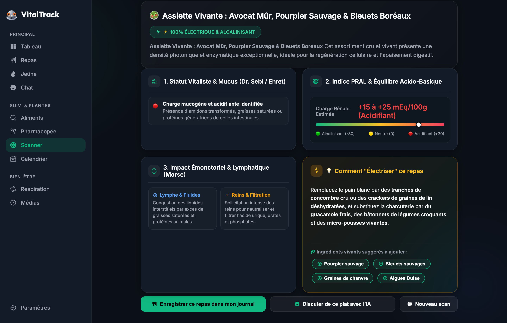
</div>

<br/>

### 📅 3. Nouveau Calendrier Cockpit & Suivi Quotidien
* **Bandeau 14 jours fluide** avec indicateurs de progression par jour (ex: `3/5 ✓`, `5/5 ✓`).
* **Cockpit du jour unifié** : Jauge de progression dynamique en temps réel, boutons de validation circulaire tactiles, modal de fusion/remplacement haute lisibilité et personnalisation rapide des plats.

<div align="center">
  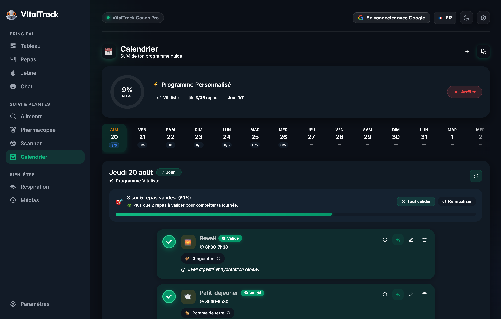
</div>

<br/>

### 🫁 4. Studio de Respiration Prānique
* Sessions interactives : **Méthode Wim Hof 3 rounds**, **Respiration Carrée (Box Breathing 4-4-4-4)**, **Cohérence Cardiaque (5.5s)** et **Respiration 4-7-8 Sommeil**.
* Compte à rebours visuel immersif et guidage vocal.

<div align="center">
  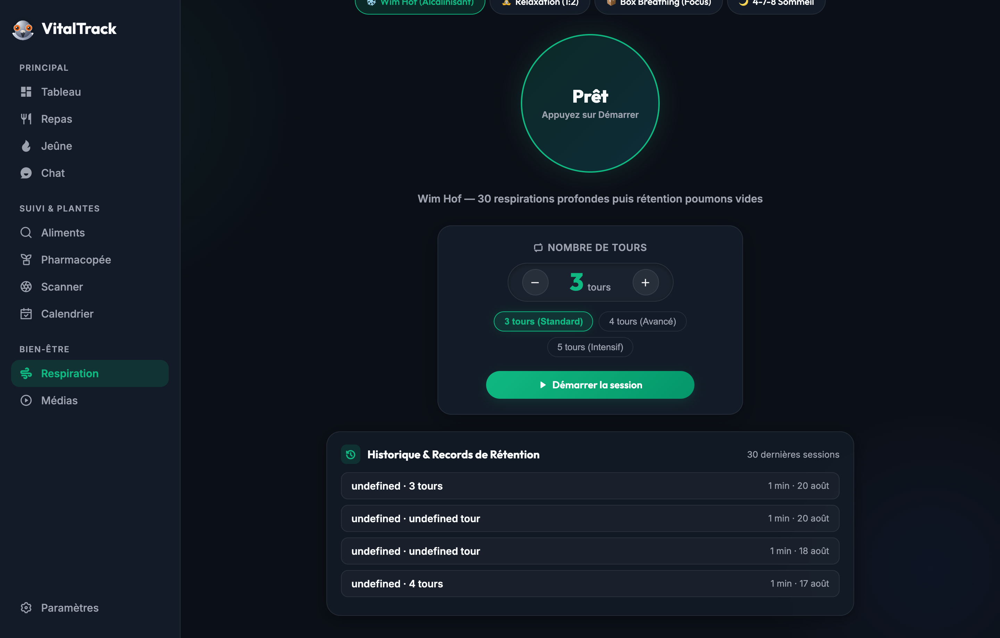
</div>

<br/>

### 📚 5. Médiathèque Bilingue HD & Masterclasses Vidéo
* Ouvrages et vidéos de référence disponibles en **Version Originale Anglaise** et en **Version Française avec Doublage Studio Multi-Voix Continu** (alternance synchronisée des voix du Dr. Sebi et de Rock Newman).

<div align="center">
  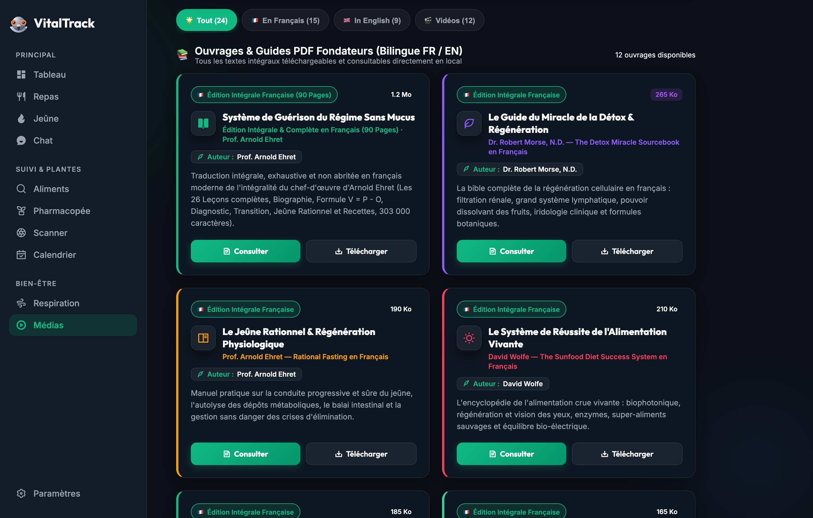
</div>

<br/>

### 🔒 6. Confidentialité & RGPD Intégral (Zero-Knowledge)
* **Architecture Zero-Knowledge** : vos données sont isolées localement sur votre appareil.
* **Droit à la portabilité (Art. 20)** : export JSON complet en 1 clic.
* **Droit à l'oubli (Art. 17)** : effacement complet et définitif en 1 clic.
* **Protection anti-capture d'écran** et synchronisation hermétique par compte Google.

<div align="center">
  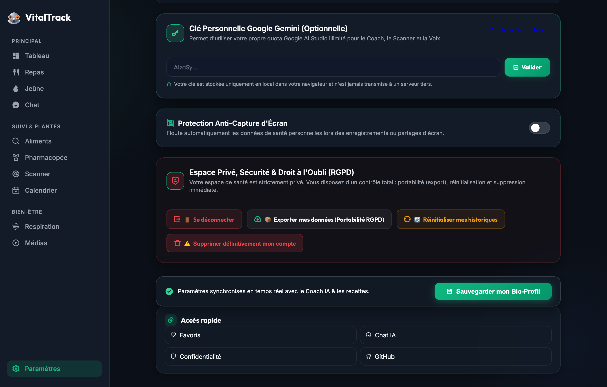
</div>

---

## 🛠️ Stack Technique

* **Frontend :** HTML5 Sémantique, Vanilla CSS Modern (Glassmorphism, CSS Variables, Responsive Grid), JavaScript ES6+ Modules.
* **Build Tool & Bundler :** [Vite](https://vitejs.dev/)
* **IA & Vision :** Google Gemini 3.7 / 2.5 API (Streaming SSE & Multimodal Vision) / Web Speech API.
* **Audio / Vidéo Engine :** Edge Neural TTS / Whisper / FFmpeg / Canvas 2D Dynamic Mascot Renderer.
* **Hébergement :** [Vercel](https://vercel.com/) (Serverless Architecture) + GitHub Pages.

---

## 💻 Installation & Développement Local

```bash
# 1. Cloner le dépôt
git clone https://github.com/fnnktkygl-code/vital_track.git
cd vital_track

# 2. Installer les dépendances du frontend
cd web-app
npm install

# 3. Lancer le serveur de développement local
npm run dev
```

---

## 📜 Conformité & Licence

* **Licence :** Distribué sous licence **MIT**.
* **Protection des Données :** Conforme au Règlement Européen sur la Protection des Données (RGPD). Consultez la [Politique de Confidentialité](https://fnnktkygl-code.github.io/vital_track/privacy.html).
